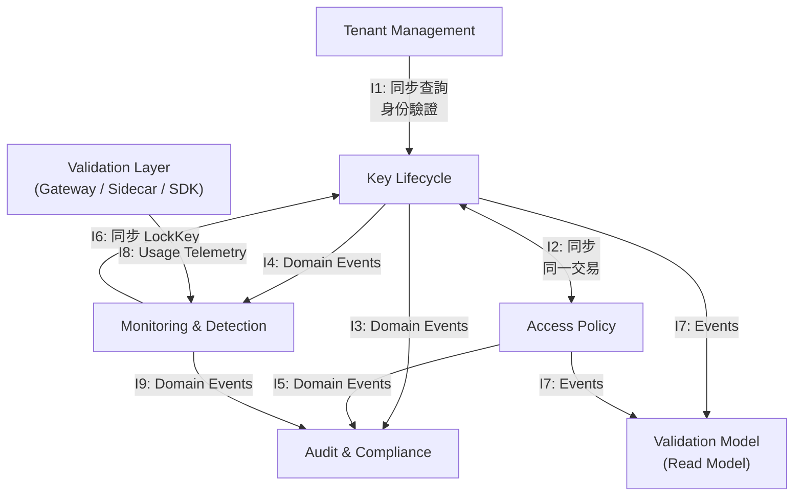

# API 金鑰管理系統 — Context Integration Spec

> 本文件為 [Design Doc](./design-doc.md) 的 Step 3 展開，定義各 Bounded Context 之間的通訊契約。
> 完成本文件後，不同 BC 可以平行開發。

---

## 1. 概述

### 1.1 文件目的

定義 5 個 Bounded Context + 1 個 Read Model 之間的所有整合關係：

- **通訊方式**：同步 API 或非同步 Domain Event
- **契約規格**：Command/Query 的 Input/Output，Event 的 Payload Schema
- **失敗處理**：重試、降級、冪等性
- **資料一致性**：最終一致或強一致

### 1.2 前置文件

- [PRD](./prd.md)（Step 1）
- [高階 Design Doc](./design-doc.md)（Step 2）
- [設計方法論](../design-methodology.md)

### 1.3 範圍

**In-Scope：**

- BC 間的所有通訊契約
- Domain Event Payload Schema
- 跨 BC 的同步 API 契約
- 外部系統與 BC 之間的資料流（Validation Layer → Monitoring 的使用資料事件）

**Out-of-Scope：**

- BC 內部的實作細節（Step 4）
- BDD 場景（Step 5）
- 具體技術選型（訊息佇列產品、序列化格式）

---

## 2. 整合關係總覽

### 2.1 通訊矩陣

| # | 上游 | 下游 | 關係類型 | 通訊方式 | 觸發頻率 |
|:--|:-----|:-----|:---------|:---------|:---------|
| I1 | Tenant Management | Key Lifecycle | Conformist | 同步查詢 | 低（金鑰建立時） |
| I2 | Key Lifecycle ↔ Access Policy | — | Partnership | 同步（同一交易）+ 非同步事件 | 中 |
| I3 | Key Lifecycle | Audit & Compliance | Pub-Sub | 非同步 Domain Event | 高 |
| I4 | Key Lifecycle | Monitoring & Detection | Pub-Sub | 非同步 Domain Event | 高 |
| I5 | Access Policy | Audit & Compliance | Pub-Sub | 非同步 Domain Event | 低 |
| I6 | Monitoring & Detection | Key Lifecycle | Customer-Supplier | 同步 API | 低（異常時） |
| I7 | Key Lifecycle + Access Policy | Validation Model | 事件投影 | 非同步 Domain Event | 高 |
| I8 | Validation Layer（外部） | Monitoring & Detection | 資料流 | 非同步 Telemetry | 極高 |
| I9 | Monitoring & Detection | Audit & Compliance | Pub-Sub | 非同步 Domain Event | 低 |

### 2.2 通訊流向圖



> **Design Doc 勘誤**：Design Doc §3.2 Context Map 將使用資料事件標示為 "Key Lifecycle → Monitoring"，實際資料來源是 Validation Layer（Gateway / Sidecar / SDK），並非 KL Aggregate。本文件以 I8 修正此歧義。

---

## 3. 共用事件信封格式

所有 Domain Event 使用統一的信封（Envelope）結構。§6 的 Payload Schema 僅描述各事件的 `payload` 欄位。

```
EventEnvelope {
  eventId:       UUID        — 全局唯一，冪等性去重依據
  eventType:     String      — 事件類型（如 "KeyCreated"）
  aggregateId:   UUID        — 產生事件的 Aggregate ID
  aggregateType: String      — Aggregate 類型（如 "ApiKey"）
  tenantId:      UUID        — 租戶隔離
  occurredAt:    Timestamp   — 事件發生時間（ISO 8601）
  version:       Integer     — 同一 Aggregate 的事件序號（遞增）
  correlationId: UUID        — 追蹤同一業務流程的關聯 ID
  causationId:   UUID        — 觸發此事件的前一個命令或事件 ID
  actor:         Actor       — 執行者
  payload:       Object      — 事件特定資料（見 §6）
}
```

```
Actor {
  type:  "User" | "System"
  id:    String             — User: 使用者 ID；System: 服務名稱（如 "monitoring-service"）
  name:  String             — 顯示名稱
}
```

**設計規則：**

- `eventId` 由事件發布端產生，消費端以此去重。
- `version` 為同一 Aggregate 內的遞增序號，消費端可用於偵測亂序。
- `correlationId` 在同一業務流程中保持一致。例如輪替流程中的 KeyRotationInitiated 與後續的 KeyGracePeriodExpired 共用同一 correlationId。
- `causationId` 指向直接觸發此事件的命令 ID 或前一個事件 ID，用於建立因果鏈。

---

## 4. BC 間整合規格

### 4.1 I1: Tenant Management → Key Lifecycle（Conformist）

**關係說明：** Key Lifecycle 直接採用 Tenant Management 的身份模型（TenantId, ConsumerId），不做模型轉換。

#### 觸發場景

| 場景 | 說明 |
|:-----|:-----|
| 金鑰建立 | KL 需驗證 ConsumerId 屬於指定 TenantId，且 Tenant 狀態為 Active |
| 金鑰查詢 | KL 的所有查詢都攜帶 TenantId 作為隔離條件 |

#### 通訊方式：同步查詢

KL 在執行命令前，同步查詢 TM 驗證身份有效性。

```
Query:   ValidateConsumer
Input:   { tenantId: UUID, consumerId: UUID }
Output:  { valid: Boolean, tenantStatus: TenantStatus }
Errors:
  TENANT_NOT_FOUND   — TenantId 不存在
  CONSUMER_NOT_FOUND — ConsumerId 不存在
  TENANT_SUSPENDED   — Tenant 已被暫停
```

#### 失敗處理

- TM 不可用 → KL 拒絕建立金鑰（Fail-Close），因為無法驗證身份。
- 不快取 TM 資料（Conformist 不維護本地副本）。

#### 資料一致性

強一致（同步查詢）。

#### 未解問題

- **Q8**（Design Doc）：Tenant 被暫停時是否級聯影響其下所有金鑰？若需級聯，需新增 TM → KL 的事件通道（TenantSuspended → 批次暫停金鑰）。目前 KL 僅在金鑰建立時查詢 TM，不訂閱 TM 事件。

---

### 4.2 I2: Key Lifecycle ↔ Access Policy（Partnership）

**關係說明：** 最緊密的 BC 關係。金鑰建立時必須同時建立策略，生命週期緊密綁定。

#### 觸發場景

| 場景 | 方向 | 說明 |
|:-----|:-----|:-----|
| 建立金鑰 | KL + AP | 同一交易內建立 ApiKey 與預設 AccessPolicy |
| 輪替金鑰 | KL + AP | 新金鑰 Key B 建立時，同步建立新的 AccessPolicy |
| 策略更新 | AP → VM, AU | 策略變更後，發布事件通知 Validation Model 與 Audit |

#### 通訊方式：混合

**同步協作（同一交易）：**

金鑰建立與策略建立由 Application Service 在同一本地交易中協調：

```
Transaction {
  1. KL: ApiKey.create(consumerId, env, scopes, expiresAt)
  2. AP: AccessPolicy.create(keyId, defaultConfig)
  3. Outbox: 寫入 KeyCreated + PolicyCreated 事件
  4. Commit
}
```

兩個 Aggregate 的操作在同一交易中，不存在跨 BC 的分散式交易問題。

**非同步事件：**

策略被 Consumer 更新後（UpdateIpAllowlist, UpdateRateLimit），AP 透過 Outbox 發布 PolicyUpdated 事件，由 Validation Model 和 Audit 訂閱。

#### 輪替時的策略處理

新金鑰 Key B 建立時，建立**全新的 AccessPolicy**（預設值），不自動繼承 Key A 的策略配置。

理由：自動繼承可能導致安全問題——Key A 的 IP 白名單可能不適用於 Key B 的部署環境。強制重新設定是 Design Doc 設計原則 #4「體驗即安全」的體現。

> **開放討論**：是否提供可選的 `copyPolicyFrom` 參數讓 Consumer 主動選擇繼承？留待 Step 4 的 Command 設計時決定。

#### 失敗處理

- 同一交易內，部分失敗即整體 rollback，不存在不一致。

#### 資料一致性

強一致（同一本地交易）。

---

### 4.3 I3: Key Lifecycle → Audit & Compliance（Pub-Sub）

**關係說明：** Audit 訂閱 KL 的所有 Domain Events，持久化為不可篡改的審計記錄。

#### 觸發場景

KL 的每一次狀態變更都產生 Domain Event，Audit 全部訂閱。

#### 通訊方式：非同步 Domain Event

| Event | 觸發時機 | Audit 處理 |
|:------|:---------|:-----------|
| KeyCreated | 新金鑰建立 | 記錄建立操作 |
| KeyRotationInitiated | 輪替啟動 | 記錄輪替，含新舊金鑰關聯 |
| KeyGracePeriodExpired | 寬限期結束 | 記錄自動撤銷 |
| KeyRevoked | 金鑰撤銷 | 記錄撤銷，含原因 |
| KeyExpired | 金鑰到期 | 記錄到期，含 previousStatus |
| KeyLocked | 系統鎖定 | 記錄鎖定，含觸發規則 |
| KeyUnlocked | 解除鎖定 | 記錄解鎖 |
| KeySuspended | 管理員暫停 | 記錄暫停，含原因 |
| KeyResumed | 恢復使用 | 記錄恢復 |

#### Audit 的消費行為

1. 收到事件
2. 轉換為 AuditEntry（提取 actor, action, resourceId, snapshots）
3. 寫入 Append-only 儲存
4. ACK

#### 失敗處理

- **消費失敗**：不 ACK，等待訊息佇列重新投遞。
- **Audit 不可用**：事件留在佇列中，待恢復後消費。不影響 KL 正常運作。
- **冪等性**：以 `eventId` 去重，同一事件不重複寫入。

#### 資料一致性

最終一致。審計記錄可能延遲數秒，可接受。

---

### 4.4 I4: Key Lifecycle → Monitoring & Detection（Pub-Sub）

**關係說明：** Monitoring 訂閱 KL 的部分 Domain Events，追蹤金鑰生命週期變化。

#### 通訊方式：非同步 Domain Event

| Event | Monitoring 用途 |
|:------|:----------------|
| KeyCreated | 開始建立該金鑰的 UsageBaseline |
| KeyRevoked | 停止監控，清理 baseline |
| KeyExpired | 停止監控，歸檔 baseline |
| KeyLocked | 更新 alert 狀態（可能由自己觸發） |
| KeyUnlocked | 恢復正常監控 |

> Monitoring 不需要訂閱所有 KL 事件——只訂閱與監控決策相關的子集。

> **輪替多事件說明**：RotateKey 在同一交易中產生 KeyRotationInitiated + KeyCreated（Key B）+ PolicyCreated 三個事件。Monitoring 需訂閱輪替產生的 KeyCreated，以開始建立 Key B 的 UsageBaseline。

#### 失敗處理

與 I3 相同。Monitoring 短暫不可用不影響安全性——最壞情況是新建金鑰的 baseline 建立延遲。

#### 資料一致性

最終一致。

---

### 4.5 I5: Access Policy → Audit & Compliance（Pub-Sub）

**關係說明：** Audit 訂閱 AP 的策略變更事件。

#### 通訊方式：非同步 Domain Event

| Event | 觸發時機 | Audit 處理 |
|:------|:---------|:-----------|
| PolicyCreated | 策略建立（隨金鑰建立） | 記錄初始配置 |
| PolicyUpdated | IP 白名單或速率限制變更 | 記錄變更前後快照 |

#### 失敗處理

與 I3 完全一致。

---

### 4.6 I6: Monitoring & Detection → Key Lifecycle（Customer-Supplier）

**關係說明：** 本系統中**唯一的跨 BC 同步呼叫**。Monitoring 偵測到異常時向 KL 發送 Lock 命令。

#### 觸發場景

| 場景 | 觸發條件 | 嚴重等級 |
|:-----|:---------|:---------|
| 高頻驗證失敗 | 1 分鐘內 > 50 次 401/403 | High |
| 流量異常激增 | 超過 UsageBaseline P95 × 3 | Medium |
| Impossible Travel | 同一金鑰短時間內來自地理距離不合理的 IP | Critical |

#### 通訊方式：同步 API

**Command 契約：**

```
Command:  LockKey

Input: {
  keyId:       UUID        — 要鎖定的金鑰
  tenantId:    UUID        — 租戶 ID（隔離驗證）
  ruleId:      UUID        — 觸發的 DetectionRule ID
  severity:    Severity    — High / Critical
  reason:      String      — 鎖定原因描述
  detectedAt:  Timestamp   — 異常偵測時間
  evidence:    Object      — 觸發證據（異常 IP、流量數據等）
}

Output (Success): {
  keyId:          UUID
  previousStatus: LifecycleStatus
  lockedAt:       Timestamp
}

Errors:
  KEY_NOT_FOUND          — 金鑰不存在
  KEY_IN_TERMINAL_STATE  — 金鑰已在終態（EXPIRED / REVOKED），無需鎖定
  KEY_ALREADY_LOCKED     — 金鑰已被鎖定
  KEY_ALREADY_SUSPENDED  — 金鑰已被暫停（人為處置優先，不覆蓋）
  UNAUTHORIZED           — 呼叫端身份驗證失敗
```

**設計決策（ADR-06）：** 安全事件不容許最終一致性的延遲，在非同步投遞期間被盜用的金鑰仍可通過驗證。

#### 失敗處理

```
LockKey 呼叫結果處理：

成功                    → 完成
KEY_IN_TERMINAL_STATE   → 忽略（金鑰已不可用）
KEY_ALREADY_LOCKED      → 忽略（已達目的）
KEY_ALREADY_SUSPENDED   → 忽略（人為處置優先）
KEY_NOT_FOUND           → 記錄警告（可能是資料不一致）
網路超時 / KL 不可用    → 進入重試策略
UNAUTHORIZED            → 緊急告警（系統間認證可能失效）
```

**重試策略：**

- 最多重試 3 次，指數退避（1s → 2s → 4s）
- 所有重試失敗後：
  1. 將 LockKey 命令寫入本地 Dead Letter Queue
  2. 發送 Critical 告警給 Security Admin
  3. 以較低頻率持續重試（每 30 秒），直到成功或人工介入

**冪等性保證：**

KL 端的 LockKey 天然冪等——金鑰已為 LOCKED 時回傳 KEY_ALREADY_LOCKED，Monitoring 視為成功。

---

### 4.7 I7: Key Lifecycle + Access Policy → Validation Model（事件投影）

**關係說明：** Validation Model 是 KL 與 AP 的 Read Model，透過訂閱 Domain Events 維護 KeyValidationView。

#### 投影規則

| Event | 投影動作 | 需主動快取失效 |
|:------|:---------|:---------------|
| KeyCreated | 建立新的 KeyValidationView 條目 | 否（首次使用時自然回源） |
| KeyRotationInitiated | 舊金鑰 status → ROTATING | 否 |
| KeyRevoked | status → REVOKED | **是** |
| KeyExpired | status → EXPIRED | 否（已過期金鑰不會再被查詢） |
| KeyLocked | status → LOCKED | **是** |
| KeyUnlocked | status → ACTIVE | 否（延遲恢復不構成安全風險） |
| KeySuspended | status → SUSPENDED | **是** |
| KeyResumed | status → ACTIVE | 否 |
| PolicyCreated | 填入初始 ipAllowlist + rateLimitConfig | 否 |
| PolicyUpdated | 更新 ipAllowlist / rateLimitConfig | **是** |

**主動快取失效規則：**

必須走 Pub/Sub 廣播至所有 Gateway 節點的事件（不得依賴 TTL 被動過期）：

- KeyRevoked — 撤銷必須立即生效
- KeyLocked — 鎖定必須立即生效
- KeySuspended — 暫停必須立即生效
- PolicyUpdated — IP 白名單或限流變更需即時反映

#### 投影延遲處理

| 場景 | 影響 | 處理 |
|:-----|:-----|:-----|
| 新金鑰剛建立，尚未投影 | 首次使用 cache miss | 回源查詢 KL，自然解決 |
| 輪替 Key B 尚未投影（Q9） | Key B 驗證可能 cache miss | 回源查詢 KL，自然解決 |
| 撤銷事件投影延遲 | 已撤銷金鑰短暫仍可驗證 | 主動快取失效機制補償 |

> **Q9 結論**：輪替期間 Key B 尚未被投影時，Gateway cache miss 後回源查詢 KL 即可取得 Key B 資料。此機制天然處理投影延遲，**無需額外設計**。

#### 失敗處理

- 投影程序不可用：事件留在佇列中，待恢復後追趕。
- 追趕期間，Gateway 對 cache miss 的請求回源查詢 KL（Fail-through to L3）。

---

### 4.8 I9: Monitoring & Detection → Audit & Compliance（Pub-Sub）

**關係說明：** Audit 訂閱 Monitoring 的安全事件，確保異常偵測與警報被審計記錄。

#### 通訊方式：非同步 Domain Event

| Event | 觸發時機 | Audit 處理 |
|:------|:---------|:-----------|
| AnomalyDetected | 偵測到流量異常 | 記錄異常偵測事件，含觸發規則與證據 |
| ImpossibleTravelDetected | 偵測到不可能的地理存取 | 記錄異常偵測事件，含地理位置證據 |

#### 失敗處理

與 I3、I5 完全一致——事件留在佇列中，待恢復後消費。不影響 Monitoring 正常運作。

#### 資料一致性

最終一致。

---

## 5. 外部系統整合點

### 5.1 I8: Validation Layer → Monitoring（使用資料事件）

**說明：** 這不是 BC 間的 Domain Event，而是驗證基礎設施（Gateway / Sidecar / SDK）產生的**使用遙測資料**，Monitoring 訂閱用於建立 UsageBaseline 和偵測異常。

#### 資料流

```
Gateway / Sidecar / SDK
  → ValidationAttempt 事件（高頻、近即時）
    → Monitoring & Detection
      → UsageBaseline 計算
      → DetectionRule 比對
      → 觸發 Alert / LockKey
```

#### Telemetry Event Schema

```
ValidationAttempt {
  attemptId:      UUID       — 唯一識別碼
  keyId:          UUID?      — 金鑰 ID（格式檢查通過後才有值）
  keyPrefix:      String     — 金鑰前綴（即使驗證失敗也可解析）
  tenantId:       UUID?      — 租戶 ID（識別後才有值）
  sourceIp:       String     — 請求來源 IP
  timestamp:      Timestamp  — 請求時間
  success:        Boolean    — 驗證是否成功
  failureLayer:   Integer?   — 失敗的漏斗層級（1-6），成功時為 null
  targetEndpoint: String     — 目標 API Endpoint
  userAgent:      String     — User-Agent
  responseTime:   Duration   — 驗證處理時間
}
```

#### 資料量考量

此資料流量級遠高於 Domain Events（每個 API 請求都產生一筆）：

- 可能需要**批次傳輸**（每 N 秒或每 N 筆批量送出），減少網路開銷
- Monitoring 端可能需要**取樣或預聚合**後再處理
- 具體的批次大小與取樣率，在技術選型階段決定

#### 失敗處理

使用資料事件的可靠性要求低於 Domain Events：

- **可容忍少量丟失**——丟失幾筆 telemetry 不影響 baseline 準確性
- **不需要 Outbox Pattern**——fire-and-forget 或 at-most-once 語意即可
- **Monitoring 不可用時**——Gateway 丟棄事件，不阻塞驗證流程

---

## 6. Domain Event Payload 目錄

> 以下僅列出各事件的 `payload` 欄位。所有事件都包含 §3 定義的 EventEnvelope 標準欄位。

### 6.1 Key Lifecycle Events

**KeyCreated**

```
{
  keyId:        UUID
  consumerId:   UUID
  tenantId:     UUID
  name:         String            — 金鑰名稱
  environment:  Environment       — Sandbox / Production
  scopes:       Set<Scope>        — 授權的操作權限集合
  keyPrefix:    String            — 金鑰前綴
  expiresAt:    Timestamp         — 過期時間
  policyId:     UUID              — 關聯的 AccessPolicy ID
}
```

**KeyRotationInitiated**

```
{
  oldKeyId:      UUID             — 進入 ROTATING 的舊金鑰
  newKeyId:      UUID             — 新建的 ACTIVE 金鑰
  graceDeadline: Timestamp        — 寬限期截止時間
}
```

**KeyGracePeriodExpired**

```
{
  keyId:          UUID            — 被自動撤銷的舊金鑰
  successorKeyId: UUID            — 後繼金鑰
}
```

**KeyRevoked**

```
{
  keyId:          UUID
  previousStatus: LifecycleStatus — 撤銷前的狀態
  reason:         String          — 撤銷原因（必填）
  revokedBy:      Actor           — 執行者（人或系統）
}
```

**KeyExpired**

```
{
  keyId:          UUID
  previousStatus: LifecycleStatus — 過期前的狀態（ACTIVE / ROTATING / SUSPENDED）
}
```

**KeyLocked**

```
{
  keyId:    UUID
  ruleId:   UUID                  — 觸發的 DetectionRule ID
  reason:   String                — 鎖定原因
  evidence: Object                — 觸發證據（異常 IP、流量數據等）
}
```

**KeyUnlocked**

```
{
  keyId:      UUID
  unlockedBy: Actor               — 解鎖操作者
}
```

**KeySuspended**

```
{
  keyId:       UUID
  suspendedBy: Actor              — 暫停操作者
  reason:      String             — 暫停原因
}
```

**KeyResumed**

```
{
  keyId:     UUID
  resumedBy: Actor                — 恢復操作者
}
```

### 6.2 Access Policy Events

**PolicyCreated**

```
{
  policyId:        UUID
  keyId:           UUID
  ipAllowlist:     Set<CidrRange>    — 初始 IP 白名單（可能為空）
  rateLimitConfig: RateLimitConfig    — 初始速率限制配置
}
```

**PolicyUpdated**

```
{
  policyId:      UUID
  keyId:         UUID
  changedFields: Set<String>          — 變更的欄位名稱集合
  before: {                           — 變更前的值（僅包含有變更的欄位）
    ipAllowlist?:     Set<CidrRange>
    rateLimitConfig?: RateLimitConfig
  }
  after: {                            — 變更後的值（僅包含有變更的欄位）
    ipAllowlist?:     Set<CidrRange>
    rateLimitConfig?: RateLimitConfig
  }
}
```

### 6.3 Monitoring Events

**AnomalyDetected**

```
{
  alertId:   UUID
  keyId:     UUID
  ruleId:    UUID
  ruleName:  String
  severity:  Severity                 — Low / Medium / High / Critical
  details: {
    metric:    String                 — 觸發的指標名稱
    threshold: Number                 — 門檻值
    actual:    Number                 — 實際值
    window:    Duration               — 偵測視窗
  }
}
```

**ImpossibleTravelDetected**

```
{
  alertId:   UUID
  keyId:     UUID
  ruleId:    UUID
  severity:  Severity                 — 通常為 Critical
  locations: [
    {
      ip:        String
      city:      String
      country:   String
      timestamp: Timestamp
    }
  ]
  travelDistance: Number              — 推算距離（公里）
  timeDelta:     Duration             — 兩次請求的時間差
}
```

---

## 7. 跨切面整合機制

### 7.1 Outbox Pattern

所有 Domain Event 的發布使用 Outbox Pattern（Design Doc §8.6）：

1. 業務操作與事件寫入在同一本地交易中完成
2. 獨立 Relay 程序讀取 Outbox 表並投遞至訊息佇列
3. 投遞成功後標記已發送

**適用範圍：**

| 通訊 | 使用 Outbox | 理由 |
|:-----|:-----------|:-----|
| I2: KL ↔ AP（同一交易） | 是 | 事件需可靠發布給 AU、MD、VM |
| I3: KL → Audit | 是（KL 端） | 確保審計記錄不遺失 |
| I4: KL → Monitoring | 是（KL 端） | 確保安全事件送達 |
| I5: AP → Audit | 是（AP 端） | 確保策略變更被審計 |
| I6: MD → KL（同步 API） | 否 | 同步呼叫，不需 Outbox |
| I8: VL → Monitoring（telemetry） | 否 | 容許丟失 |
| I9: MD → Audit | 是（MD 端） | 確保安全事件被審計 |

### 7.2 冪等性

**事件消費端規則：**

所有消費端以 `eventId` 去重：

- 首次收到 → 正常處理 + 記錄 eventId
- 重複收到 → 跳過處理，直接 ACK

去重記錄保留期：至少 7 天（覆蓋可能的最大重新投遞延遲）。

**LockKey 的冪等性：** KL 端天然冪等——金鑰已鎖定時回傳 KEY_ALREADY_LOCKED，Monitoring 視為成功。

### 7.3 事件順序保證

| 範圍 | 保證 | 實作方式 |
|:-----|:-----|:---------|
| 同一 Aggregate 內 | **保證順序** | 以 Aggregate ID 作為 Partition Key |
| 跨 Aggregate | **不保證** | 消費端不可假設順序 |
| 跨 BC | **不保證** | KeyCreated 與 PolicyCreated 可能以任意順序到達 Audit |

**消費端亂序處理建議：**

若收到 version = N+2 但未收到 N+1：

- **方案 A**：等待 N+1 到達後再處理（需暫存）
- **方案 B**：直接處理 N+2，後續補處理 N+1（需冪等）

建議除非有強順序需求，否則採用方案 B，降低複雜度。

### 7.4 失敗處理總則

| 通訊類型 | 失敗策略 | 最終兜底 |
|:---------|:---------|:---------|
| 同步查詢（I1, I6） | 重試 3 次 + 指數退避 | Fail-Close + 告警 |
| 非同步 Domain Event（I3-I5, I7, I9） | 訊息佇列自動重投遞 | Dead Letter Queue + 人工介入 |
| Telemetry（I8） | Fire-and-forget | 丟棄（可接受） |

**Dead Letter Queue 處理：**

事件重試超過 5 次後進入 DLQ：
1. 觸發 Ops 告警
2. 人工排查後重新投遞

---

## 8. 整合品質檢查點

依 [design-methodology.md](../design-methodology.md) §7 驗證：

- [ ] 所有 Context Map 關係（I1-I7, I9）都有整合規格
- [ ] 外部系統整合點（I8）已定義
- [ ] 所有非同步 Event 都有 Payload Schema（§6）
- [ ] 所有同步 API 都有 Command 契約（§4.1, §4.6）
- [ ] 失敗場景都有處理策略（各 §4.x + §7.4）
- [ ] 冪等性規則已定義（§7.2）
- [ ] 事件順序保證已定義（§7.3）
- [ ] Outbox Pattern 適用範圍已明確（§7.1）
