# 企業級 API 金鑰管理系統 — 架構設計文件

## 1. 概述與設計目標

### 1.1 問題陳述

API 金鑰本質上是 Bearer Token——持有者即可存取。在機器對機器（M2M）通訊場景中，金鑰洩漏、過度授權、缺乏輪替機制等問題，可能導致未授權存取與資料外洩。

本文件基於 [PRD](./prd.md) 的需求分析與威脅模型，定義一套**全生命週期金鑰治理系統**的架構設計。目標是在開發者體驗（DX）與資安管控之間取得平衡。

### 1.2 設計原則

以下四條原則作為所有架構決策的裁決標準。當設計方案出現衝突時，依此排序取捨：

1. **金鑰即密碼** — 以儲存使用者密碼的同等規格（雜湊、加鹽、不可逆）來儲存 API 金鑰。影響：儲存層、生成流程。
2. **狀態機是核心** — 金鑰生命週期以有限狀態機（FSM）嚴謹管控，特別是輪替寬限期與 Locked / Suspended 的區分。影響：領域模型、核心流程。
3. **治理重於防禦** — 防火牆是基礎，但基於身份的治理（權限範圍、配額、審計）才是 M2M 威脅的有效應對。影響：存取策略、審計、監控。
4. **體驗即安全** — 流暢的輪替工具與清晰的錯誤提示，能降低開發者犯錯的機率。影響：服務暴露模式、錯誤處理。

### 1.3 文件範圍

**In-Scope:**

- 金鑰管理系統後台的模組分解與領域模型
- 金鑰狀態機的完整定義
- 核心業務流程（生成、驗證、輪替、撤銷、緊急處置）
- 服務暴露模式分析（API Gateway / SDK / Sidecar）
- 跨切面關注點（Multi-tenancy、審計、快取、監控）

**Out-of-Scope:**

- 具體技術選型（程式語言、框架、資料庫、雲端供應商）
- 部署拓撲與基礎設施架構
- UI/UX 設計細節（Developer Portal 與 Admin Console 的介面設計）
- API Schema 定義（OpenAPI / GraphQL 等）

### 1.4 術語表

> **Living Document**：本節在整份設計文件撰寫過程中持續更新。遇到任何專有名詞或術語，皆會回頭補充至此處。

| 術語 | 定義 |
|:---|:---|
| Aggregate Root | 聚合根，DDD 中一組相關物件的入口點，負責維護聚合內的一致性規則 |
| Bearer Token | 持有者令牌——任何持有該令牌的請求者即被視為已授權 |
| Bounded Context | 限界上下文，領域驅動設計（DDD）中劃分子領域的邊界單位 |
| Consumer | API 的使用者（人或系統），通常是第三方開發者或內部其他團隊 |
| Conformist | DDD 整合模式。下游 Context 完全接受上游 Context 的模型，不做轉換。表示下游對上游有強依賴 |
| Context Map | 上下文映射，描述 Bounded Context 之間的關係與整合模式 |
| Customer-Supplier | DDD 整合模式。上游（Supplier）與下游（Customer）之間的協作關係，上游有義務滿足下游的需求 |
| CSPRNG | 密碼學安全的偽亂數產生器（Cryptographically Secure Pseudo-Random Number Generator） |
| Domain Event | 領域事件，表示領域中已發生的重要事實，用於跨 Bounded Context 通訊 |
| FSM | 有限狀態機（Finite State Machine） |
| Partnership | DDD 整合模式。兩個 Context 之間的對等協作關係，雙方共同演進、互相配合 |
| Publisher-Subscriber | DDD 整合模式。上游 Context 發布事件，下游 Context 訂閱並自行處理。雙方無直接依賴 |
| Grace Period | 金鑰輪替時，新舊金鑰同時有效的寬限期 |
| Read Model | 讀取模型，為查詢最佳化的資料視圖，從 Domain Event 投影而來 |
| Outbox Pattern | 分散式系統中確保事件可靠發布的模式。狀態變更與事件寫入同一交易，由獨立 Relay 程序投遞至訊息佇列 |
| Scope | 授權的操作權限，以 `resource:action` 格式表示（如 `orders:read`） |
| Scope Registry | Scope 的全局註冊表，由 Service Owner 維護，紀錄所有可用的 `resource:action` 組合 |
| SIEM | 安全資訊與事件管理系統（Security Information and Event Management） |
| Tenant | 多租戶架構中的隔離單位，通常對應一個組織或專案 |
| Value Object | 值物件，DDD 中以屬性值（而非身份）定義的不可變物件 |
| WORM | 一次寫入多次讀取（Write Once Read Many）的儲存策略 |

---

## 2. 系統上下文

### 2.1 Context Diagram

下圖呈現金鑰管理系統在整體架構中的位置，以及與外部角色和系統的互動關係。

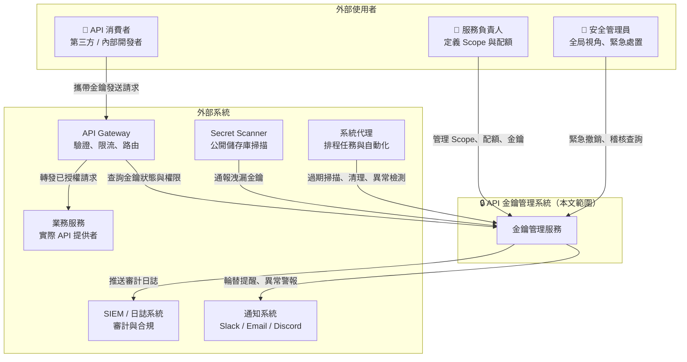
```mermaid
graph TB
    subgraph 外部使用者
        consumer["👤 API 消費者<br/>第三方 / 內部開發者"]
        owner["👤 服務負責人<br/>定義 Scope 與配額"]
        admin["👤 安全管理員<br/>全局視角、緊急處置"]
    end

    subgraph core["🔒 API 金鑰管理系統（本文範圍）"]
        keyMgmt["金鑰管理服務"]
    end

    subgraph 外部系統
        gateway["API Gateway<br/>驗證、限流、路由"]
        biz["業務服務<br/>實際 API 提供者"]
        siem["SIEM / 日誌系統<br/>審計與合規"]
        notify["通知系統<br/>Slack / Email / Discord"]
        scanner["Secret Scanner<br/>公開儲存庫掃描"]
        agent["系統代理<br/>排程任務與自動化"]
    end

    consumer -->|"攜帶金鑰發送請求"| gateway
    gateway -->|"查詢金鑰狀態與權限"| keyMgmt
    gateway -->|"轉發已授權請求"| biz
    owner -->|"管理 Scope、配額、金鑰"| keyMgmt
    admin -->|"緊急撤銷、稽核查詢"| keyMgmt
    keyMgmt -->|"推送審計日誌"| siem
    keyMgmt -->|"輪替提醒、異常警報"| notify
    scanner -->|"通報洩漏金鑰"| keyMgmt
    agent -->|"過期掃描、清理、異常檢測"| keyMgmt
```

### 2.2 外部系統職責

| 外部系統 | 與金鑰管理系統的關係 | 整合方向 |
|:---|:---|:---|
| **API Gateway** | 金鑰驗證的**執行點**。Gateway 向金鑰管理系統查詢金鑰的有效性、Scope 與限流策略，並據此做出放行或拒絕的決策 | 雙向：查詢 + 快取失效通知 |
| **業務服務** | Gateway 放行後的實際請求處理者。業務服務**不直接**與金鑰管理系統互動 | 無直接整合 |
| **SIEM / 日誌系統** | 接收金鑰管理系統推送的所有審計日誌，提供長期儲存、合規查詢與異常告警 | 單向：推送 |
| **通知系統** | 接收金鑰管理系統的事件通知（輪替提醒、異常警報、金鑰即將過期），透過 Slack / Email / Discord 傳遞給相關人員 | 單向：推送 |
| **Secret Scanner** | 掃描公開程式碼儲存庫（如 GitHub Public Repos），識別已洩漏的金鑰前綴，並通報金鑰管理系統觸發自動撤銷 | 單向：接收通報 |
| **系統代理** | 執行排程任務的自動化程式：過期金鑰掃描、殭屍金鑰清理、流量基線計算、異常行為檢測 | 雙向：讀取 + 寫入 |

### 2.3 系統邊界定義

**我們擁有的（Owned）：**

- 金鑰管理服務——本設計文件的核心範圍。包含金鑰生命週期管理、存取策略引擎、審計日誌產生器、事件發布器。

**我們整合的（Integrated）：**

- API Gateway：作為驗證的執行點，需要明確定義查詢介面與快取失效協定。
- SIEM：需要定義日誌格式與推送機制。
- 通知系統：需要定義事件類型與通知管道對應關係。
- Secret Scanner：需要定義通報介面與自動撤銷流程。

**不歸我們管的（External）：**

- 業務服務的內部邏輯——它只接收 Gateway 轉發的已授權請求。
- Consumer 端的金鑰保管方式——我們只能透過最佳實踐指引來降低風險，無法強制。

### 2.4 信任邊界

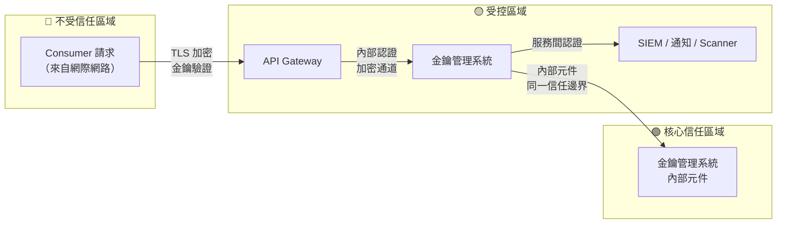
```mermaid
graph LR
    subgraph untrusted["🔴 不受信任區域"]
        ext["Consumer 請求<br/>（來自網際網路）"]
    end

    subgraph controlled["🟡 受控區域"]
        gw["API Gateway"]
        km["金鑰管理系統"]
        integrations["SIEM / 通知 / Scanner"]
    end

    subgraph trusted["🟢 核心信任區域"]
        internal["金鑰管理系統<br/>內部元件"]
    end

    ext -->|"TLS 加密<br/>金鑰驗證"| gw
    gw -->|"內部認證<br/>加密通道"| km
    km -->|"服務間認證"| integrations
    km -->|"內部元件<br/>同一信任邊界"| internal
```

**邊界規則：**

- **🔴 → 🟡（不受信任 → 受控）**：所有流量必須經過 TLS 加密。金鑰以 HTTP Header 傳遞（禁止 URL 參數）。Gateway 作為唯一入口，執行格式檢查與限流。
- **🟡 內部（受控區域之間）**：系統間通訊需使用服務間認證（如 mTLS 或內部 Token）。快取失效訊息需確保送達（至少一次語意）。
- **🟡 → 🟢（受控 → 核心信任）**：金鑰管理系統的內部元件之間，在同一信任邊界內運作。金鑰明文僅在生成瞬間存在於記憶體中，不跨越任何網路邊界。

---

<!-- 以下章節將於後續迭代中逐步撰寫 -->

## 3. Bounded Context 與模組分解

### 3.1 Context 總覽

| Bounded Context | 分類 | 核心職責 | 擁有的資料 |
|:---|:---|:---|:---|
| **Key Lifecycle** | 🔵 Core | 金鑰建立、狀態流轉、輪替、撤銷 | ApiKey |
| **Access Policy** | 🟢 Supporting | Scope 定義、IP 白名單、速率限制策略管理 | AccessPolicy |
| **Audit & Compliance** | 🟢 Supporting | 不可篡改的操作記錄、合規查詢 | AuditEntry |
| **Monitoring & Detection** | 🟢 Supporting | 流量基線、異常偵測、自動化防禦規則 | DetectionRule, SecurityAlert, UsageBaseline |
| **Tenant Management** | ⚪ Generic | 組織與專案身份管理、多租戶隔離 | Tenant, Consumer |

**Validation Model**（金鑰驗證模型）不是獨立的 Bounded Context，而是 Key Lifecycle + Access Policy 的專用 Read Model。它不擁有業務邏輯，只組合兩個 Context 的資料，為高頻驗證路徑提供低延遲的查詢能力。

### 3.2 Context Map

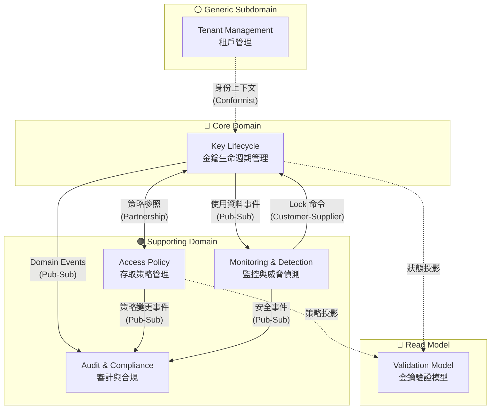
```mermaid
graph TB
    subgraph core["🔵 Core Domain"]
        KL["Key Lifecycle<br/>金鑰生命週期管理"]
    end

    subgraph supporting["🟢 Supporting Domain"]
        AP["Access Policy<br/>存取策略管理"]
        AU["Audit & Compliance<br/>審計與合規"]
        MD["Monitoring & Detection<br/>監控與威脅偵測"]
    end

    subgraph generic["⚪ Generic Subdomain"]
        TM["Tenant Management<br/>租戶管理"]
    end

    subgraph readmodel["📖 Read Model"]
        VM["Validation Model<br/>金鑰驗證模型"]
    end

    TM -.->|"身份上下文<br/>(Conformist)"| KL
    KL <-->|"策略參照<br/>(Partnership)"| AP
    KL -->|"Domain Events<br/>(Pub-Sub)"| AU
    KL -->|"使用資料事件<br/>(Pub-Sub)"| MD
    AP -->|"策略變更事件<br/>(Pub-Sub)"| AU
    MD -->|"安全事件<br/>(Pub-Sub)"| AU
    MD -->|"Lock 命令<br/>(Customer-Supplier)"| KL
    KL -.->|"狀態投影"| VM
    AP -.->|"策略投影"| VM
```

**Context 間關係說明：**

| 關係 | 類型 | 說明 |
|:---|:---|:---|
| Tenant → Key Lifecycle | Conformist | Key Lifecycle 直接採用 Tenant 的身份模型（TenantId, ConsumerId），不做轉換 |
| Key Lifecycle ↔ Access Policy | Partnership | 緊密協作。金鑰建立時必須關聯策略，策略變更需通知驗證快取失效 |
| Key Lifecycle → Audit | Publisher-Subscriber | Key Lifecycle 發布 Domain Events，Audit 訂閱並持久化為不可篡改記錄 |
| Key Lifecycle → Monitoring | Publisher-Subscriber | 發布使用資料事件，Monitoring 用於建立基線與偵測異常 |
| Access Policy → Audit | Publisher-Subscriber | 策略變更事件同樣需要審計記錄 |
| Monitoring → Audit | Publisher-Subscriber | 安全警報與偵測規則變更事件需要審計記錄 |
| Monitoring → Key Lifecycle | Customer-Supplier | Monitoring 偵測異常時，向 Key Lifecycle 發送 Lock 命令 |
| Key Lifecycle + Access Policy → Validation Model | 事件投影 | 透過 Domain Events 將金鑰狀態與策略資料投影至 Read Model |

### 3.3 Context 間通訊原則

1. **事件驅動優先**：Context 之間以 Domain Event 作為主要通訊手段，確保鬆耦合。
2. **安全命令例外**：Monitoring → Key Lifecycle 的 Lock 命令使用同步呼叫，因安全事件需即時回應。
3. **資料隔離**：每個 Context 擁有自己的資料儲存，禁止跨 Context 直接存取資料庫。
4. **投影一致性**：Validation Model 透過事件投影維護讀取快取，接受最終一致性（Eventual Consistency）。但金鑰撤銷事件需走**主動快取失效**路徑，以縮短撤銷生效的延遲。

### 3.4 各 Context 職責邊界

#### Key Lifecycle Management（🔵 Core Domain）

- **職責**：管理金鑰從建立到銷毀的完整生命週期，是系統最核心的業務邏輯所在。
- **擁有**：ApiKey 聚合（含狀態機）
- **對外介面**：
  - 命令：CreateKey, RotateKey, RevokeKey, SuspendKey, ResumeKey, LockKey, UnlockKey
  - 查詢：GetKeyById, ListKeysByConsumer
  - 事件：KeyCreated, KeyRotated, KeyRevoked, KeyLocked, KeySuspended, KeyExpired 等
- **依賴**：Tenant（身份上下文）、Access Policy（策略關聯）

#### Access Policy（🟢 Supporting Domain）

- **職責**：管理與金鑰關聯的存取規則——IP 白名單、速率限制、配額。
- **擁有**：AccessPolicy 聚合
- **對外介面**：
  - 命令：CreatePolicy, UpdateIpAllowlist, UpdateRateLimit
  - 查詢：GetPolicyByKeyId
  - 事件：PolicyCreated, PolicyUpdated
- **設計決策**：Scopes 歸屬於 ApiKey（描述「金鑰能做什麼」），而非 AccessPolicy。AccessPolicy 專注於「金鑰怎麼被使用」的操作限制。

#### Audit & Compliance（🟢 Supporting Domain）

- **職責**：記錄所有管理操作的不可篡改日誌，支援合規查詢。
- **擁有**：AuditEntry
- **特性**：
  - 純寫入（Append-only），不可修改、不可刪除
  - 訂閱所有其他 Context 的 Domain Events
  - 支援匯出至外部 SIEM
- **對外介面**：
  - 查詢：SearchAuditLogs（按時間、Actor、Action、Resource 過濾）
  - 無命令介面——僅透過事件訂閱寫入

#### Monitoring & Threat Detection（🟢 Supporting Domain）

- **職責**：即時監控金鑰使用行為，偵測異常並執行自動化防禦。
- **擁有**：DetectionRule, SecurityAlert, UsageBaseline
- **對外介面**：
  - 命令：CreateRule, UpdateRule, AcknowledgeAlert
  - 查詢：ListAlerts, GetUsageDashboard
  - 事件：AnomalyDetected, ImpossibleTravelDetected
- **特殊能力**：可向 Key Lifecycle 發送 LockKey 命令（唯一被允許發送同步命令的 Context）

#### Tenant Management（⚪ Generic Subdomain）

- **職責**：管理組織與專案的身份，提供多租戶隔離的基礎。
- **擁有**：Tenant, Consumer
- **對外介面**：
  - 命令：CreateTenant, RegisterConsumer
  - 查詢：GetTenant, ListConsumers
- **隔離規則**：所有其他 Context 的資料查詢必須在 Tenant 邊界內執行。Tenant A 的資料對 Tenant B 不可見。

---

## 4. 領域模型

### 4.1 實體關係總覽

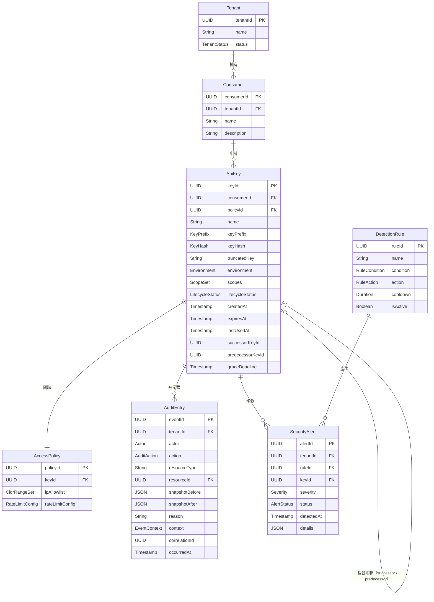
```mermaid
erDiagram
    Tenant ||--o{ Consumer : "擁有"
    Consumer ||--o{ ApiKey : "申請"
    ApiKey ||--|| AccessPolicy : "關聯"
    ApiKey ||--o{ AuditEntry : "被記錄"
    ApiKey ||--o{ SecurityAlert : "觸發"
    DetectionRule ||--o{ SecurityAlert : "產生"
    ApiKey o|--o| ApiKey : "輪替關聯（successor / predecessor）"

    Tenant {
        UUID tenantId PK
        String name
        TenantStatus status
    }

    Consumer {
        UUID consumerId PK
        UUID tenantId FK
        String name
        String description
    }

    ApiKey {
        UUID keyId PK
        UUID consumerId FK
        UUID policyId FK
        String name
        KeyPrefix keyPrefix
        KeyHash keyHash
        String truncatedKey
        Environment environment
        ScopeSet scopes
        LifecycleStatus lifecycleStatus
        Timestamp createdAt
        Timestamp expiresAt
        Timestamp lastUsedAt
        UUID successorKeyId
        UUID predecessorKeyId
        Timestamp graceDeadline
    }

    AccessPolicy {
        UUID policyId PK
        UUID keyId FK
        CidrRangeSet ipAllowlist
        RateLimitConfig rateLimitConfig
    }

    AuditEntry {
        UUID eventId PK
        UUID tenantId FK
        Actor actor
        AuditAction action
        String resourceType
        UUID resourceId FK
        JSON snapshotBefore
        JSON snapshotAfter
        String reason
        EventContext context
        UUID correlationId
        Timestamp occurredAt
    }

    DetectionRule {
        UUID ruleId PK
        String name
        RuleCondition condition
        RuleAction action
        Duration cooldown
        Boolean isActive
    }

    SecurityAlert {
        UUID alertId PK
        UUID tenantId FK
        UUID ruleId FK
        UUID keyId FK
        Severity severity
        AlertStatus status
        Timestamp detectedAt
        JSON details
    }
```

### 4.2 Key Lifecycle Context

**Aggregate Root: ApiKey**

| 屬性 | 類型 | 說明 |
|:---|:---|:---|
| keyId | UUID | 公開識別碼，用於日誌、UI、API 引用 |
| tenantId | TenantId | 所屬租戶（跨 Context 參照） |
| consumerId | ConsumerId | 申請者（跨 Context 參照） |
| name | String | 使用者自定義的金鑰名稱（如 "my-production-key"），用於識別與管理。同一 Consumer + Environment 內不可重複 |
| keyPrefix | KeyPrefix | 金鑰前綴（如 `acme_prod_`），用於識別與格式校驗 |
| keyHash | KeyHash | 加鹽雜湊值，禁止儲存明文 |
| truncatedKey | String | 金鑰後四碼（如 `...a9B3`），用於管理介面顯示 |
| environment | Environment | Sandbox 或 Production |
| scopes | Set\<Scope\> | 授權的操作權限集合 |
| lifecycleStatus | LifecycleStatus | 當前狀態（見第 5 章狀態機） |
| policyId | PolicyId | 關聯的存取策略（跨 Context 參照） |
| createdAt | Timestamp | 建立時間 |
| expiresAt | Timestamp | 過期時間（不允許永久有效） |
| lastUsedAt | Timestamp | 最近一次成功驗證時間 |
| successorKeyId | UUID? | 輪替時的新金鑰 ID（僅 Rotating 狀態有值） |
| predecessorKeyId | UUID? | 前任金鑰 ID（由輪替產生的新金鑰持有） |
| graceDeadline | Timestamp? | 寬限期截止時間（僅 Rotating 狀態有值） |

**Value Objects：**

- **KeyPrefix** — 結構化前綴，格式為 `{service}_{env}_`（如 `acme_prod_`）。封裝前綴解析與驗證邏輯。
- **KeyHash** — 包含雜湊值與鹽值的不可變物件。封裝恆定時間比較邏輯。
- **Environment** — 列舉值：Sandbox, Production。強制環境隔離規則。
- **Scope** — 格式為 `resource:action`（如 `orders:read`）。封裝格式驗證。

**金鑰格式規格：**

完整金鑰由三個欄位組成：`{prefix}_{random}_{checksum}`

| 欄位 | 職責 | 長度範圍 | 說明 |
|:---|:---|:---|:---|
| `prefix` | 服務與環境識別 | 6-20 字元 | 格式為 `{service}_{env}`，如 `acme_prod`。用於 Secret Scanner 識別洩漏金鑰的來源，也讓 Gateway 在第 1 層格式檢查即可判斷環境 |
| `random` | 不可預測的隨機部分 | 32-48 字元 | 由 CSPRNG 產生，提供 256-bit 以上的熵。具體編碼方式（hex / base62 / base64url）於技術選型階段決定 |
| `checksum` | 快速格式校驗 | 4-8 字元 | 讓 Gateway 在不查詢資料庫的情況下過濾明顯的亂輸入（如打字錯誤、截斷的金鑰）。具體演算法於技術選型階段決定 |

金鑰總長度範圍：**42-76 字元**（含分隔符）。欄位間以 `_` 分隔。

**Scope 模型說明：**

Scope 的定義與管理機制：

- **來源**：Scope 由 Service Owner 在金鑰管理系統中註冊。系統維護一份全局的 Scope Registry（屬於 Key Lifecycle Context 的參考資料），紀錄所有可用的 `resource:action` 組合。金鑰建立時只能選擇 Registry 中已存在的 Scope。
- **Wildcard 語意**：支援 `resource:*` 作為該資源的全權限快捷方式。展開規則：`orders:*` 等價於該資源下所有已註冊的 action。不支援 `*:*`（違反最小權限原則）。
- **變更影響**：當 Scope Registry 中移除某個 Scope 時，已關聯該 Scope 的金鑰不會被自動修改（避免無聲無息地縮減權限），但系統應發出警告通知 Service Owner 處理孤兒 Scope。新建金鑰時無法再選擇已移除的 Scope。

**業務規則：**

- 金鑰建立時必須指定過期時間，系統不允許永久有效的金鑰
- 金鑰建立時必須選擇至少一個 Scope（最小權限原則）
- 同一 Consumer 在同一 Environment 下，Active 狀態的金鑰數量應有上限
- Rotating 狀態的金鑰在 Grace Period 內仍可通過驗證

### 4.3 Access Policy Context

**Aggregate Root: AccessPolicy**

| 屬性 | 類型 | 說明 |
|:---|:---|:---|
| policyId | UUID | 策略識別碼 |
| keyId | KeyId | 關聯的金鑰（1:1 關係） |
| ipAllowlist | Set\<CidrRange\> | 允許的 IP 網段清單（空集合表示不限制） |
| rateLimitConfig | RateLimitConfig | 速率限制設定 |

**Value Objects：**

- **CidrRange** — CIDR 格式的 IP 網段（如 `192.168.1.0/24`）。支援 IPv4 與 IPv6。封裝 IP 比對邏輯。
- **RateLimitConfig** — quotaLimit（週期總次數）、quotaPeriod（配額週期，限定為 1min / 1hour / 1day / 1month）、rateLimit（瞬時 RPS 上限）、burstLimit（突發容忍量，必須 ≥ rateLimit）。

**業務規則：**

- IP 白名單為空時，不限制來源 IP（預設開放）
- 設定白名單時禁止使用 0.0.0.0/0 或 ::/0（等同無限制但具誤導性，應以空集合表達「不限制」）
- 設定白名單後，非清單內 IP 的請求即使金鑰正確也必須拒絕
- 超過配額應返回 HTTP 429

### 4.4 Audit Context

**Aggregate Root: AuditEntry**

| 屬性 | 類型 | 說明 |
|:---|:---|:---|
| eventId | UUID | 唯一識別碼 |
| tenantId | TenantId | 所屬租戶（用於隔離查詢） |
| actor | Actor | 執行者（使用者 ID 或系統服務名稱） |
| action | AuditAction | 操作類型列舉 |
| resourceType | String | 受影響的資源類型（如 "ApiKey", "AccessPolicy", "SecurityAlert"） |
| resourceId | UUID | 受影響的資源 ID |
| snapshotBefore | JSON | 修改前的屬性快照 |
| snapshotAfter | JSON | 修改後的屬性快照 |
| reason | String | 操作理由（撤銷操作為必填） |
| context | EventContext | 來源 IP、User-Agent 等環境資訊 |
| correlationId | UUID | 業務流程關聯 ID（追蹤同一流程的多筆審計記錄，如輪替流程） |
| occurredAt | Timestamp | 事件發生時間 |

**不可變性保證**：AuditEntry 一經寫入即不可修改或刪除。儲存層必須支援 WORM 語意。

### 4.5 Monitoring & Detection Context

**Entity: DetectionRule**

| 屬性 | 類型 | 說明 |
|:---|:---|:---|
| ruleId | UUID | 規則識別碼 |
| name | String | 規則名稱（如「高頻 403 錯誤」） |
| condition | RuleCondition | 觸發條件（如「1 分鐘內 >50 次 401/403」） |
| action | RuleAction | 觸發動作：Lock / Notify / Throttle |
| cooldown | Duration | 冷卻時間，防止重複觸發 |
| isActive | Boolean | 是否啟用 |

**Entity: UsageBaseline**

| 屬性 | 類型 | 說明 |
|:---|:---|:---|
| keyId | UUID | 對應金鑰 |
| period | Duration | 基線計算週期 |
| avgRequestRate | Number | 平均請求速率 |
| p95RequestRate | Number | P95 請求速率 |
| lastCalculated | Timestamp | 最近一次計算時間 |

**Entity: SecurityAlert**

| 屬性 | 類型 | 說明 |
|:---|:---|:---|
| alertId | UUID | 警報識別碼 |
| tenantId | TenantId | 所屬租戶（建立 Alert 時從 keyId 解析並冗餘儲存，避免查詢時跨 BC 跳轉） |
| ruleId | UUID | 觸發此警報的規則 |
| keyId | UUID | 受影響的金鑰 |
| severity | Severity | Low / Medium / High / Critical |
| status | AlertStatus | Open / Acknowledged / Resolved |
| detectedAt | Timestamp | 偵測時間 |
| details | JSON | 觸發細節（異常 IP、流量數據等） |

### 4.6 Tenant Context

**Aggregate Root: Tenant**

| 屬性 | 類型 | 說明 |
|:---|:---|:---|
| tenantId | UUID | 租戶識別碼 |
| name | String | 組織名稱 |
| status | TenantStatus | Active / Suspended |

**Entity: Consumer**

| 屬性 | 類型 | 說明 |
|:---|:---|:---|
| consumerId | UUID | 消費者識別碼 |
| tenantId | TenantId | 所屬租戶 |
| name | String | 專案或應用程式名稱 |
| description | String | 用途描述 |

**隔離規則**：所有跨 Context 的查詢必須攜帶 TenantId 作為隔離條件。Tenant 下可有多個 Consumer，每個 Consumer 可擁有多個 ApiKey。

### 4.7 Validation Read Model

Validation Model 是 Key Lifecycle 與 Access Policy 的投影，專為驗證路徑最佳化。

**KeyValidationView（非正規化視圖）：**

| 屬性 | 來源 | 用於驗證漏斗的哪一層 |
|:---|:---|:---|
| keyPrefix | Key Lifecycle | 第 1 層：格式檢查 |
| lifecycleStatus | Key Lifecycle | 第 2 層：狀態檢查 |
| ipAllowlist | Access Policy | 第 3 層：IP 檢查 |
| keyHash | Key Lifecycle | 第 4 層：雜湊驗證 |
| scopes | Key Lifecycle | 第 5 層：權限檢查 |
| environment | Key Lifecycle | 環境隔離校驗 |
| rateLimitConfig | Access Policy | 限流決策 |
| tenantId | Key Lifecycle | 租戶隔離 |

驗證漏斗（Validation Funnel）由上至下逐層過濾，每一層的成本遞增：

1. **格式檢查**（前綴 + 長度）→ 純記憶體操作，極快
2. **狀態檢查**（是否 Active 或 Rotating）→ 查詢 Read Model
3. **IP 檢查**（來源 IP 是否在白名單）→ 查詢 Read Model
4. **雜湊驗證**（恆定時間比較）→ 計算密集
5. **權限檢查**（Scope 涵蓋目標 Endpoint）→ 查詢 Read Model

### 4.8 Domain Events 目錄

**Key Lifecycle 發布：**

| Event | 觸發時機 | 主要消費者 |
|:---|:---|:---|
| KeyCreated | 新金鑰建立 | Audit, Monitoring |
| KeyRotationInitiated | 輪替啟動，舊金鑰進入 Rotating | Audit, Validation Model |
| KeyGracePeriodExpired | 寬限期結束，舊金鑰自動撤銷 | Audit, Validation Model |
| KeyRevoked | 金鑰被永久撤銷 | Audit, Validation Model, Monitoring |
| KeyExpired | 金鑰到期失效 | Audit, Validation Model |
| KeyLocked | 金鑰被系統鎖定 | Audit, Validation Model |
| KeyUnlocked | 金鑰解除鎖定 | Audit, Validation Model |
| KeySuspended | 金鑰被管理員暫停 | Audit, Validation Model |
| KeyResumed | 金鑰從暫停恢復 | Audit, Validation Model |

**Access Policy 發布：**

| Event | 觸發時機 | 主要消費者 |
|:---|:---|:---|
| PolicyCreated | 新策略建立 | Audit |
| PolicyUpdated | 策略修改（IP / Rate Limit） | Audit, Validation Model |

**Monitoring 發布：**

| Event | 觸發時機 | 主要消費者 |
|:---|:---|:---|
| AnomalyDetected | 偵測到流量異常 | Audit, 通知系統（外部） |
| ImpossibleTravelDetected | 偵測到不可能的地理位置存取 | Audit, 通知系統, Key Lifecycle（觸發 Lock） |

## 5. 金鑰狀態機

狀態機是本系統的核心。金鑰的所有行為都受狀態機約束，任何不在轉換表中的操作均應被拒絕。

### 5.1 狀態定義

| 狀態 | 語意 | 可通過驗證 | 終態 |
|:---|:---|:---|:---|
| **Active** | 金鑰正常運作，可接受請求 | ✅ | 否 |
| **Rotating** | 舊金鑰處於輪替寬限期，新金鑰已生成。雙活狀態，新舊皆可用 | ✅ | 否 |
| **Locked** | 系統自動防禦觸發的鎖定，拒絕所有請求 | ❌ | 否 |
| **Suspended** | 管理員手動暫停，拒絕所有請求。可逆的行政處置 | ❌ | 否 |
| **Expired** | 金鑰已過期（達到 expiresAt） | ❌ | ✅ |
| **Revoked** | 金鑰已被永久撤銷 | ❌ | ✅ |

### 5.2 狀態圖

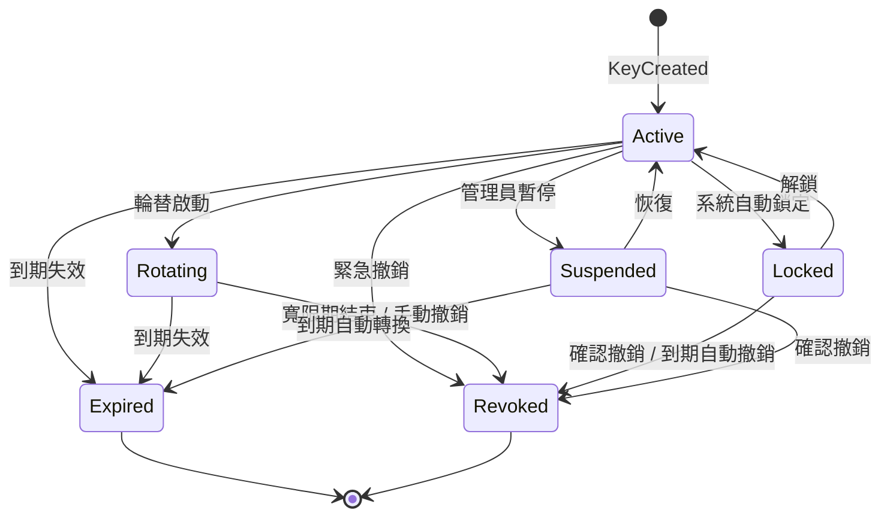
```mermaid
stateDiagram-v2
    [*] --> Active: KeyCreated

    Active --> Rotating: 輪替啟動
    Active --> Locked: 系統自動鎖定
    Active --> Suspended: 管理員暫停
    Active --> Revoked: 緊急撤銷
    Active --> Expired: 到期失效

    Rotating --> Revoked: 寬限期結束 / 手動撤銷
    Rotating --> Expired: 到期失效

    Locked --> Active: 解鎖
    Locked --> Revoked: 確認撤銷 / 到期自動撤銷

    Suspended --> Active: 恢復
    Suspended --> Revoked: 確認撤銷
    Suspended --> Expired: 到期自動轉換

    Expired --> [*]
    Revoked --> [*]
```

### 5.3 轉換規則表

| # | From | To | 觸發者 | 前置條件 | 執行動作 | 產生事件 |
|:---|:---|:---|:---|:---|:---|:---|
| T1 | Active | Rotating | Consumer / Service Owner | 該 Consumer 在同環境下無其他 Rotating 金鑰 | 產生新金鑰 Key B（Active），設定 successorKeyId 與 graceDeadline | KeyRotationInitiated |
| T2 | Active | Locked | Monitoring / 系統代理 | DetectionRule 觸發條件成立 | 更新狀態，記錄觸發規則 ID | KeyLocked |
| T3 | Active | Suspended | Security Admin / Service Owner | 操作者具備相應權限，暫停原因（必填） | 更新狀態，記錄暫停原因 | KeySuspended |
| T4 | Active | Revoked | Security Admin / Secret Scanner | 無（最高優先級操作） | 更新狀態，記錄撤銷原因（必填），主動快取失效 | KeyRevoked |
| T5 | Active | Expired | 系統代理（定時掃描） | now ≥ expiresAt | 更新狀態 | KeyExpired |
| T6 | Rotating | Revoked | 系統代理（自動）/ Admin | now ≥ graceDeadline 或手動撤銷 | 更新狀態，清除輪替關聯 | KeyGracePeriodExpired / KeyRevoked |
| T7 | Rotating | Expired | 系統代理 | now ≥ expiresAt（且尚未達 graceDeadline） | 更新狀態，註記 previousStatus | KeyExpired |
| T8 | Locked | Active | Security Admin | 管理員確認無風險，或冷卻時間到期 | 更新狀態 | KeyUnlocked |
| T9 | Locked | Revoked | Security Admin | 管理員確認金鑰已洩陷 | 更新狀態，記錄原因（必填） | KeyRevoked |
| T10 | Locked | Revoked | 系統代理（定時掃描） | now ≥ expiresAt | 更新狀態，自動填入原因「System: locked key expired (rule: {ruleId})」，主動快取失效 | KeyRevoked |
| T11 | Suspended | Active | Security Admin / Service Owner | 管理員決定恢復 | 更新狀態 | KeyResumed |
| T12 | Suspended | Revoked | Security Admin | 管理員確認撤銷 | 更新狀態，記錄原因（必填） | KeyRevoked |
| T13 | Suspended | Expired | 系統代理 | now ≥ expiresAt | 更新狀態，註記 previousStatus | KeyExpired |

### 5.4 Locked vs Suspended

這兩個狀態都會導致金鑰無法通過驗證，但它們的**觸發來源**與**業務意圖**完全不同：

| 面向 | Locked | Suspended |
|:---|:---|:---|
| **觸發來源** | 系統自動（Monitoring / DetectionRule） | 人為手動（Security Admin / Service Owner） |
| **業務意圖** | 緊急預防性技術防禦，阻斷疑似攻擊 | 行政管理處置，提供「維持現狀」與「永久撤銷」之間的緩衝 |
| **典型場景** | 連續多次驗證失敗、短時間內大量 401/403、異常流量激增 | 懷疑洩漏但尚未確認、合作夥伴合約中止、內部調查期間 |
| **解除方式** | 管理員手動解鎖，或冷卻時間自動解除 | 管理員手動恢復（Resume） |
| **設計意義** | 讓系統在無人介入時也能即時回應威脅 | 讓管理員擁有可逆的介入手段 |

**架構強制規則：**

- Active → Locked 的轉換**只能**由系統自動化程式觸發，管理員不可手動鎖定金鑰。
- Active → Suspended 的轉換**只能**由具備權限的管理員手動觸發。
- 兩者皆可流轉至 Revoked（不可逆終點）。

### 5.5 輪替機制詳解（Dual-Active）

輪替是最容易導致服務中斷的環節。雙活機制確保零停機輪替：

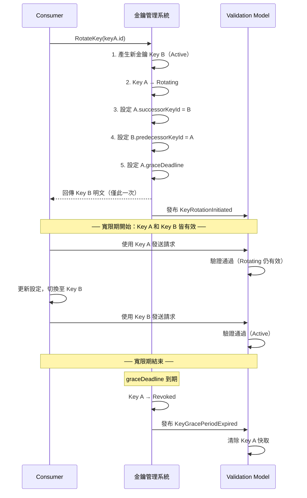
```mermaid
sequenceDiagram
    participant C as Consumer
    participant KM as 金鑰管理系統
    participant VM as Validation Model

    C->>KM: RotateKey(keyA.id)
    KM->>KM: 1. 產生新金鑰 Key B（Active）
    KM->>KM: 2. Key A → Rotating
    KM->>KM: 3. 設定 A.successorKeyId = B
    KM->>KM: 4. 設定 B.predecessorKeyId = A
    KM->>KM: 5. 設定 A.graceDeadline
    KM-->>C: 回傳 Key B 明文（僅此一次）
    KM->>VM: 發布 KeyRotationInitiated

    Note over C,VM: ── 寬限期開始：Key A 和 Key B 皆有效 ──
    C->>VM: 使用 Key A 發送請求
    VM->>VM: 驗證通過（Rotating 仍有效）
    C->>C: 更新設定，切換至 Key B
    C->>VM: 使用 Key B 發送請求
    VM->>VM: 驗證通過（Active）
    Note over C,VM: ── 寬限期結束 ──

    Note over KM: graceDeadline 到期
    KM->>KM: Key A → Revoked
    KM->>VM: 發布 KeyGracePeriodExpired
    VM->>VM: 清除 Key A 快取
```

**輪替流程要點：**

1. 輪替操作是**原子的**：產生 Key B 與 Key A 狀態轉換必須在同一交易中完成。
2. 寬限期長度**可配置**（建議預設 24 小時，高敏感服務可設為 7 天）。
3. 寬限期內，Key A 的每次成功驗證應在回應中附帶警告（如 `X-API-Key-Deprecated: true`），提示 Consumer 儘快切換。
4. 同一 Consumer 在同一 Environment 下，**只允許一個 Rotating 金鑰**，防止輪替鏈（A→B→C 同時存在）。

### 5.6 過期自動轉換規則

當金鑰達到 expiresAt 時，系統代理根據當前狀態採取**分流處理**，以保留安全上下文：

| 當前狀態 | 過期後轉入 | 理由 |
|:---|:---|:---|
| Active | Expired | 正常生命週期結束，自然死亡 |
| Rotating | Expired | 輪替中的舊金鑰到期，屬於正常淘汰。應檢查 successor 是否正常運作 |
| Suspended | Expired | 行政暫停期間到期，未確認安全事件，視為正常過期 |
| **Locked** | **Revoked** | **Locked 代表系統偵測到異常行為。若自動轉為 Expired，將抹除「曾涉及安全事件」的上下文。轉為 Revoked 並自動填入撤銷原因，在狀態語意上區分「自然死亡」與「異常死亡」** |

**註記機制**：

- 轉入 Expired 的事件（KeyExpired）必須攜帶 `previousStatus` 欄位，以區分「正常到期」與「從 Suspended/Rotating 自動轉換」。
- 轉入 Revoked 的事件（KeyRevoked）由系統代理自動填入原因，格式為 `System: locked key expired (original lock rule: {ruleId})`，保留原始鎖定規則的關聯性。

此設計確保：
1. 審計日誌能清楚追溯每把金鑰的完整轉換路徑。
2. 安全管理員可透過查詢 Revoked 狀態的金鑰，快速篩選出生命週期中曾發生過安全事件的金鑰記錄。
3. Expired 狀態的語意保持純粹：只代表「正常生命週期結束」，不包含任何安全事件暗示。

### 5.7 狀態機不變量（Invariants）

以下規則必須在任何時刻成立，違反任一條即為系統 Bug：

1. **終態不可逆**：Expired 與 Revoked 沒有任何向外的轉換。
2. **Rotating 必有 Successor**：處於 Rotating 狀態的金鑰，successorKeyId 必不為 null。
3. **Successor 必為 Active**：Rotating 金鑰的 successor 必須處於 Active 狀態。
4. **單一 Rotating**：同一 Consumer 在同一 Environment 下，最多只能有一個 Rotating 金鑰。
5. **Locked 僅限系統**：Active → Locked 的轉換只能由系統自動化程式觸發。
6. **Suspended 僅限人為**：Active → Suspended 的轉換只能由具權限的管理員觸發。
7. **撤銷必須有因**：任何轉為 Revoked 的操作，必須提供撤銷原因（reason 不可為空）。
8. **環境不可變**：金鑰的 Environment（Sandbox / Production）在建立後不可變更。

## 6. 核心流程

### 6.1 金鑰生成（Key Generation）

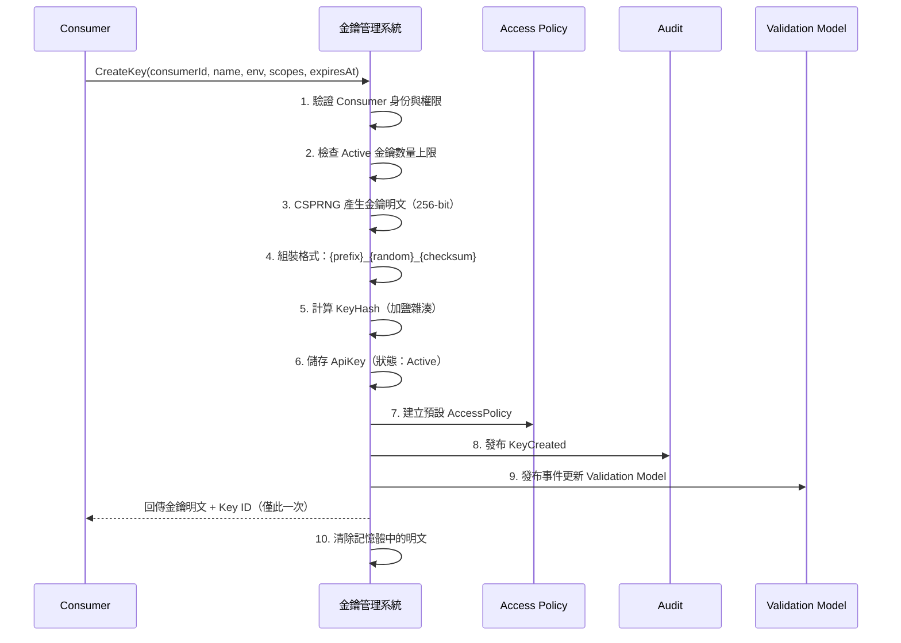
```mermaid
sequenceDiagram
    participant C as Consumer
    participant KM as 金鑰管理系統
    participant AP as Access Policy
    participant AU as Audit
    participant VM as Validation Model

    C->>KM: CreateKey(consumerId, name, env, scopes, expiresAt)
    KM->>KM: 1. 驗證 Consumer 身份與權限
    KM->>KM: 2. 檢查 Active 金鑰數量上限
    KM->>KM: 3. CSPRNG 產生金鑰明文（256-bit）
    KM->>KM: 4. 組裝格式：{prefix}_{random}_{checksum}
    KM->>KM: 5. 計算 KeyHash（加鹽雜湊）
    KM->>KM: 6. 儲存 ApiKey（狀態：Active）
    KM->>AP: 7. 建立預設 AccessPolicy
    KM->>AU: 8. 發布 KeyCreated
    KM->>VM: 9. 發布事件更新 Validation Model
    KM-->>C: 回傳金鑰明文 + Key ID（僅此一次）
    KM->>KM: 10. 清除記憶體中的明文
```

**設計要點：**

- **Display Once 原則**：金鑰明文只在建立時回傳一次。回應送出後立即清除記憶體。資料庫僅存雜湊值，連管理員也無法找回明文。
- **格式結構**：`{prefix}_{random}_{checksum}`。Prefix 用於識別服務與環境（如 `acme_prod_`），Checksum 讓 Gateway 能在不查詢資料庫的情況下快速過濾格式錯誤的請求。
- **最小權限預設**：若 Consumer 未明確指定 Scopes，系統應拒絕建立（而非給予全權限），強制開發者思考所需權限。
- **原子性**：ApiKey 建立與 AccessPolicy 建立必須在同一交易中完成，避免出現「有金鑰但無策略」的不一致狀態。

### 6.2 金鑰驗證（Key Validation）

最高頻的運作路徑，對效能與安全性都有嚴格要求。驗證漏斗的資料結構定義見 [§4.7 Validation Read Model](#47-validation-read-model)。

#### 6.2.1 驗證漏斗（Validation Funnel）

每一層的成本遞增，先用便宜的檢查過濾明顯無效的請求：

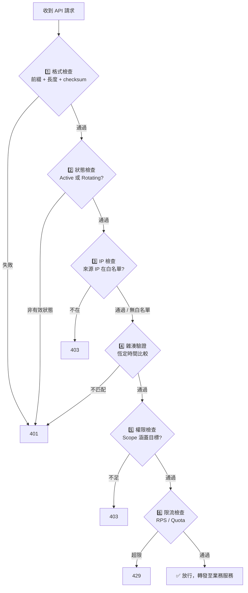
```mermaid
flowchart TD
    A["收到 API 請求"] --> B{"1️⃣ 格式檢查<br/>前綴 + 長度 + checksum"}
    B -->|失敗| R1["401"]
    B -->|通過| C{"2️⃣ 狀態檢查<br/>Active 或 Rotating?"}
    C -->|非有效狀態| R1
    C -->|通過| D{"3️⃣ IP 檢查<br/>來源 IP 在白名單?"}
    D -->|不在| R2["403"]
    D -->|通過 / 無白名單| E{"4️⃣ 雜湊驗證<br/>恆定時間比較"}
    E -->|不匹配| R1
    E -->|通過| F{"5️⃣ 權限檢查<br/>Scope 涵蓋目標?"}
    F -->|不足| R3["403"]
    F -->|通過| G{"6️⃣ 限流檢查<br/>RPS / Quota"}
    G -->|超限| R4["429"]
    G -->|通過| H["✅ 放行，轉發至業務服務"]
```

#### 6.2.2 快取互動模式

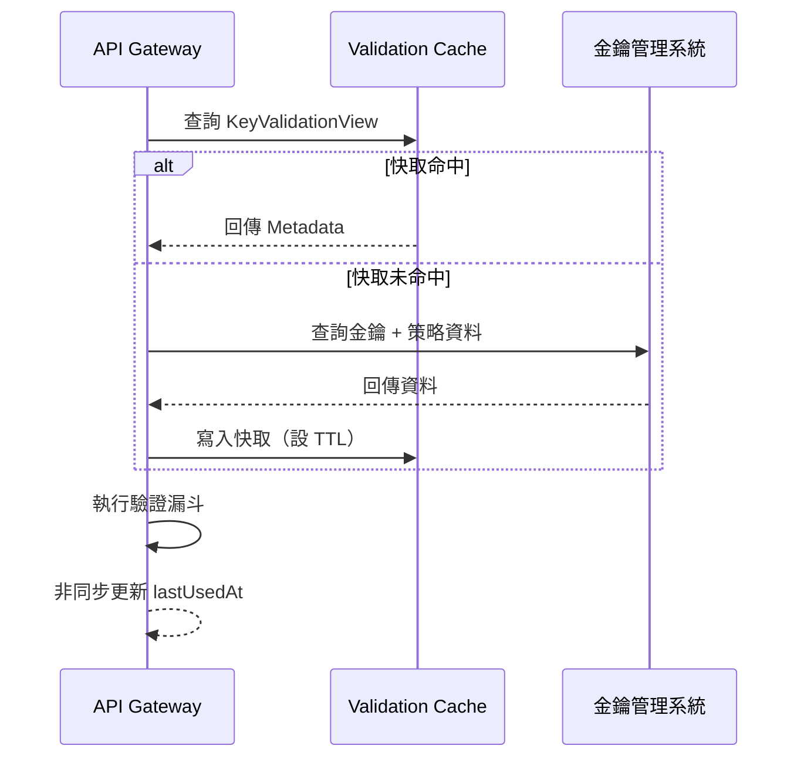
```mermaid
sequenceDiagram
    participant GW as API Gateway
    participant Cache as Validation Cache
    participant KM as 金鑰管理系統

    GW->>Cache: 查詢 KeyValidationView
    alt 快取命中
        Cache-->>GW: 回傳 Metadata
    else 快取未命中
        GW->>KM: 查詢金鑰 + 策略資料
        KM-->>GW: 回傳資料
        GW->>Cache: 寫入快取（設 TTL）
    end
    GW->>GW: 執行驗證漏斗
    GW-->>GW: 非同步更新 lastUsedAt
```

**雜湊驗證與 Salt 策略：**

KeyHash 的 Salt 採用 **per-key 獨立鹽值**，而非全局共用。驗證流程中，Gateway 不直接持有獨立的 Salt 欄位：

- **第 1~3 層檢查**（格式、狀態、IP）：不涉及雜湊比對，快取中的 KeyValidationView 即可完成。
- **第 4 層雜湊驗證**：KeyValidationView 中包含預計算的 `keyHash`（內含 Salt）。Gateway 將請求中的金鑰明文以相同演算法與內嵌的 Salt 重新計算雜湊後進行恆定時間比對。Salt 不會以獨立欄位傳輸，而是內嵌在雜湊值中（如 `$algorithm$salt$hash` 格式）。
- **安全考量**：即使快取層被入侵，攻擊者獲得的也僅是雜湊值（含內嵌 Salt），無法逆向還原金鑰明文，與資料庫中儲存的內容一致，不引入額外風險。

**快取失效策略：**

- **被動過期**：快取設定 TTL（建議 5-15 分鐘），到期自動失效。
- **主動失效**：金鑰被撤銷、鎖定、暫停或策略變更時，金鑰管理系統透過事件廣播立即清除各 Gateway 節點的對應快取。撤銷等安全事件不得依賴被動過期，必須走主動失效路徑。

#### 6.2.3 錯誤回應設計

安全原則：不向攻擊者洩漏金鑰的存在性或狀態資訊。

| 場景 | HTTP Status | 說明 |
|:---|:---|:---|
| 金鑰格式錯誤 | 401 | 與「金鑰不存在」回傳相同回應，防止列舉攻擊 |
| 金鑰不存在 | 401 | 同上 |
| 金鑰非有效狀態 | 401 | 同上。禁止回傳「金鑰已撤銷」等具體狀態 |
| 雜湊不匹配 | 401 | 同上。必須用恆定時間比較，防止 Timing Attack |
| IP 不在白名單 | 403 | 可返回「IP not allowed」，因 IP 資訊對請求者不是秘密 |
| Scope 不足 | 403 | 可在回應中包含所需 Scope，協助開發者排錯 |
| 速率超限 | 429 | 必須包含 `Retry-After` Header |
| 配額耗盡 | 429 | 包含配額重置時間 |

**關鍵安全規則**：前四種 401 場景必須回傳完全相同的 Response Body 與一致的回應時間，防止攻擊者透過錯誤訊息差異或時間差異推測金鑰狀態。

### 6.3 金鑰輪替（Key Rotation）

完整的 Dual-Active 輪替流程已在 [5.5 輪替機制詳解](#55-輪替機制詳解dual-active) 中定義，此處不重複。

補充：**強制輪替提醒流程**：

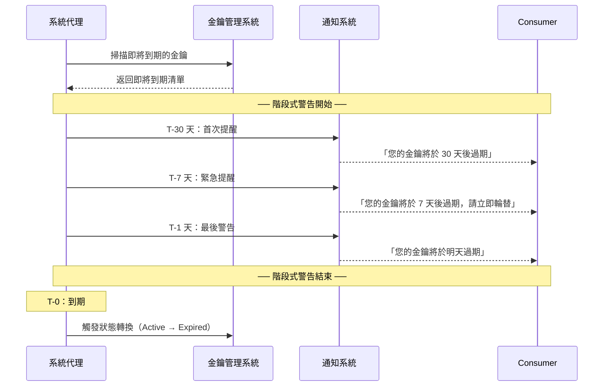
```mermaid
sequenceDiagram
    participant Agent as 系統代理
    participant KM as 金鑰管理系統
    participant NT as 通知系統
    participant C as Consumer

    Agent->>KM: 掃描即將到期的金鑰
    KM-->>Agent: 返回即將到期清單

    Note over Agent,C: ── 階段式警告開始 ──
    Agent->>NT: T-30 天：首次提醒
    NT-->>C: 「您的金鑰將於 30 天後過期」
    Agent->>NT: T-7 天：緊急提醒
    NT-->>C: 「您的金鑰將於 7 天後過期，請立即輪替」
    Agent->>NT: T-1 天：最後警告
    NT-->>C: 「您的金鑰將於明天過期」
    Note over Agent,C: ── 階段式警告結束 ──

    Note over Agent: T-0：到期
    Agent->>KM: 觸發狀態轉換（Active → Expired）
```

提醒間隔應可配置（上述 30/7/1 天為建議預設值）。

### 6.4 撤銷與緊急處置（Revocation & Emergency）

#### 6.4.1 管理員手動撤銷

流程相對簡單：管理員透過 Admin Console 選擇金鑰 → 填寫撤銷原因（必填）→ 確認 → 金鑰狀態轉為 Revoked → 主動快取失效 → 發布 KeyRevoked 事件。

關鍵：撤銷操作具最高優先級，繞過所有快取機制（透過全局 Pub/Sub 通知所有 Gateway 節點）。

#### 6.4.2 Secret Scanner 自動撤銷

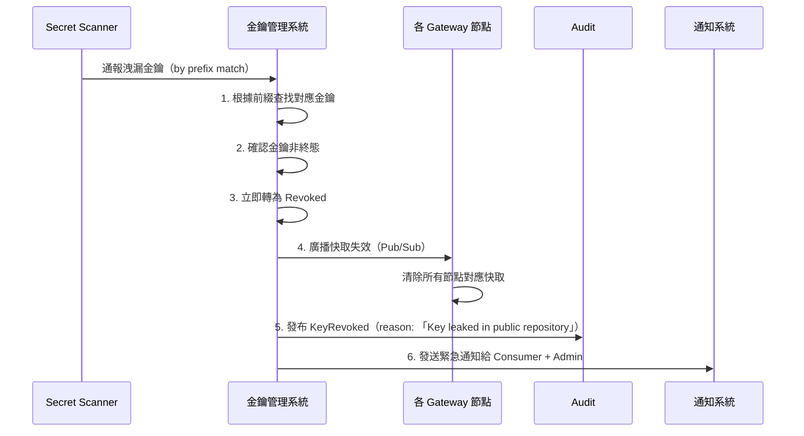
```mermaid
sequenceDiagram
    participant SC as Secret Scanner
    participant KM as 金鑰管理系統
    participant VM as 各 Gateway 節點
    participant AU as Audit
    participant NT as 通知系統

    SC->>KM: 通報洩漏金鑰（by prefix match）
    KM->>KM: 1. 根據前綴查找對應金鑰
    KM->>KM: 2. 確認金鑰非終態
    KM->>KM: 3. 立即轉為 Revoked
    KM->>VM: 4. 廣播快取失效（Pub/Sub）
    VM->>VM: 清除所有節點對應快取
    KM->>AU: 5. 發布 KeyRevoked（reason: 「Key leaked in public repository」）
    KM->>NT: 6. 發送緊急通知給 Consumer + Admin
```

**設計要點：**

- Scanner 透過金鑰前綴（如 `acme_prod_`）識別洩漏的金鑰。這是 PRD 中 R-SEC-01 要求金鑰包含可識別前綴的核心原因。
- 自動撤銷不需人工審批，速度就是一切。
- 通知必須同時發送給 Consumer（「你的金鑰已被撤銷，請立即輪替」）與 Security Admin（「偵測到金鑰洩漏，已自動撤銷」）。

### 6.5 異常偵測與自動鎖定（Anomaly Detection & Auto-Lock）

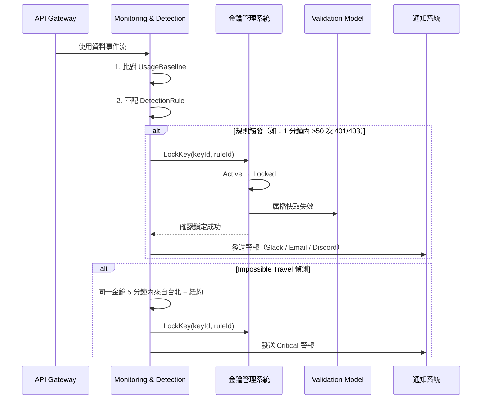
```mermaid
sequenceDiagram
    participant GW as API Gateway
    participant MD as Monitoring & Detection
    participant KM as 金鑰管理系統
    participant VM as Validation Model
    participant NT as 通知系統

    GW->>MD: 使用資料事件流
    MD->>MD: 1. 比對 UsageBaseline
    MD->>MD: 2. 匹配 DetectionRule

    alt 規則觸發（如：1 分鐘內 >50 次 401/403）
        MD->>KM: LockKey(keyId, ruleId)
        KM->>KM: Active → Locked
        KM->>VM: 廣播快取失效
        KM-->>MD: 確認鎖定成功
        MD->>NT: 發送警報（Slack / Email / Discord）
    end

    alt Impossible Travel 偵測
        MD->>MD: 同一金鑰 5 分鐘內來自台北 + 紐約
        MD->>KM: LockKey(keyId, ruleId)
        MD->>NT: 發送 Critical 警報
    end
```

**Monitoring → Key Lifecycle 的 Lock 命令是整個系統中唯一的跨 Context 同步呼叫**，因為安全事件不容許最終一致性的延遲。若呼叫失敗，Monitoring 必須重試並發送管理員警報。

## 7. 服務暴露模式

金鑰管理系統的核心價值在於「將金鑰驗證與授權決策從業務服務中剝離」。本章分析三種將驗證能力暴露給使用端的模式，以及各自的適用場景。

### 7.1 模式總覽

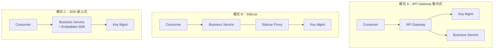
```mermaid
graph TB
    subgraph 模式A["模式 A：API Gateway 集中式"]
        CA["Consumer"] --> GWA["API Gateway"]
        GWA --> KMA["Key Mgmt"]
        GWA --> BizA["Business Service"]
    end

    subgraph 模式B["模式 B：Sidecar"]
        CB["Consumer"] --> BizB["Business Service"]
        BizB --- SCB["Sidecar Proxy"]
        SCB --> KMB["Key Mgmt"]
    end

    subgraph 模式C["模式 C：SDK 嵌入式"]
        CC["Consumer"] --> BizC["Business Service<br/>+ Embedded SDK"]
        BizC --> KMC["Key Mgmt"]
    end
```

### 7.2 模式 A：API Gateway 集中式

所有 API 流量經過統一的 Gateway，Gateway 負責金鑰驗證、限流、路由轉發。業務服務完全不感知金鑰的存在。

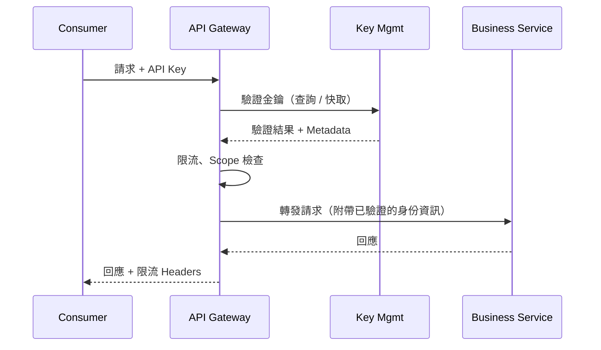
```mermaid
sequenceDiagram
    participant C as Consumer
    participant GW as API Gateway
    participant KM as Key Mgmt
    participant Biz as Business Service

    C->>GW: 請求 + API Key
    GW->>KM: 驗證金鑰（查詢 / 快取）
    KM-->>GW: 驗證結果 + Metadata
    GW->>GW: 限流、Scope 檢查
    GW->>Biz: 轉發請求（附帶已驗證的身份資訊）
    Biz-->>GW: 回應
    GW-->>C: 回應 + 限流 Headers
```

**優勢：**

- 單一執行點，策略一致性最高。所有驗證邏輯集中在 Gateway，更新策略時不需變更業務服務。
- 業務服務零侵入。不需任何程式碼變更即可納管。
- 快取失效只需通知 Gateway 節點，操作簡單。

**劣勢：**

- 單點故障與效能瓶頸。所有流量都經過 Gateway，需投入額外的高可用與擴展設計。
- 增加網路跳數（延遲）。每個請求多一跳 Gateway。
- 對內部服務間（East-West）流量不夠自然。內部服務彼此呼叫若也經過 Gateway，會造成不必要的跨跳。

**適用場景：**外部 API 開放（North-South 流量）、組織已有 API Gateway 基礎設施、對一致性要求高於延遲要求的場景。

### 7.3 模式 B：Sidecar Proxy

每個業務服務實例旁掛一個輕量級的 Proxy 程式，負責攔截入站流量並執行金鑰驗證。

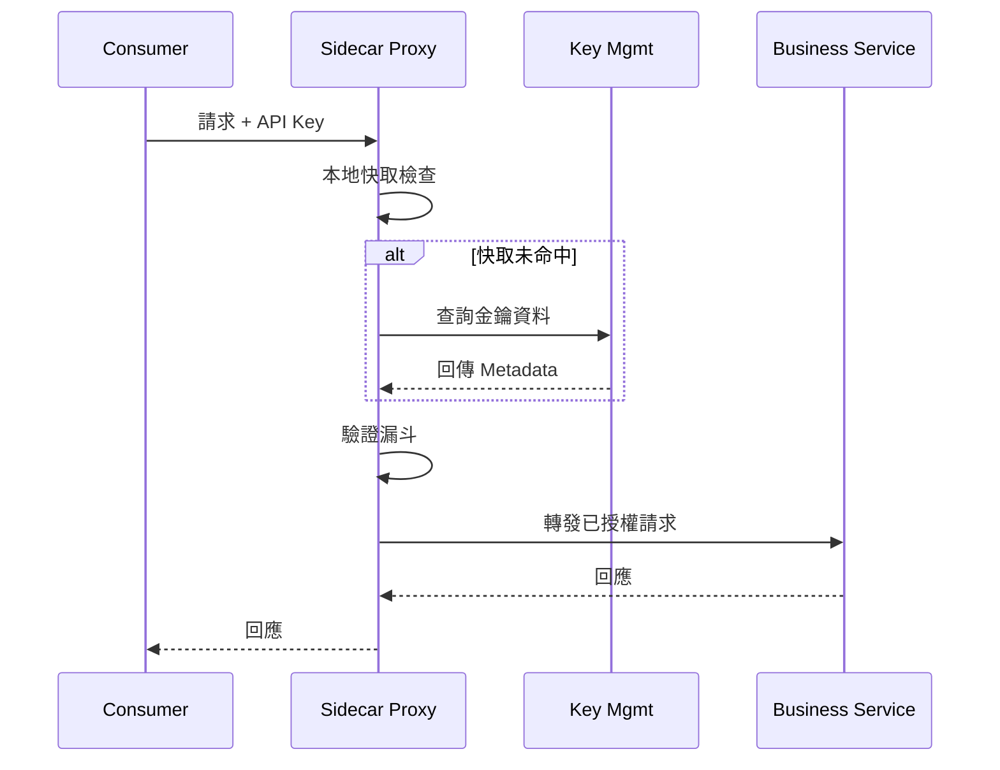
```mermaid
sequenceDiagram
    participant C as Consumer
    participant SC as Sidecar Proxy
    participant KM as Key Mgmt
    participant Biz as Business Service

    C->>SC: 請求 + API Key
    SC->>SC: 本地快取檢查
    alt 快取未命中
        SC->>KM: 查詢金鑰資料
        KM-->>SC: 回傳 Metadata
    end
    SC->>SC: 驗證漏斗
    SC->>Biz: 轉發已授權請求
    Biz-->>SC: 回應
    SC-->>C: 回應
```

**優勢：**

- 去中心化，沒有單點故障。每個服務實例獨立執行驗證。
- 業務服務仍然零侵入。Sidecar 作為基礎設施層部署，程式碼無需變更。
- 適合 East-West 流量。內部服務間呼叫自然經過 Sidecar 驗證。
- 本地快取更貼近服務，延遲更低。

**劣勢：**

- 運維複雜度高。每個服務實例都多一個 Sidecar 程式需要部署、監控、升級。
- 快取失效較複雜。需要將失效訊息廣播到所有 Sidecar 實例（數量可能遠多於 Gateway 節點）。
- 資源開銷。每個 Sidecar 都消耗 CPU 與記憶體。

**適用場景：**微服務 / Service Mesh 架構、內部服務間的 M2M 驗證、已有 Sidecar 基礎設施（如 Envoy / Istio）的組織。

### 7.4 模式 C：SDK 嵌入式

業務服務直接引入金鑰管理系統提供的 SDK，在程式碼層級執行驗證。

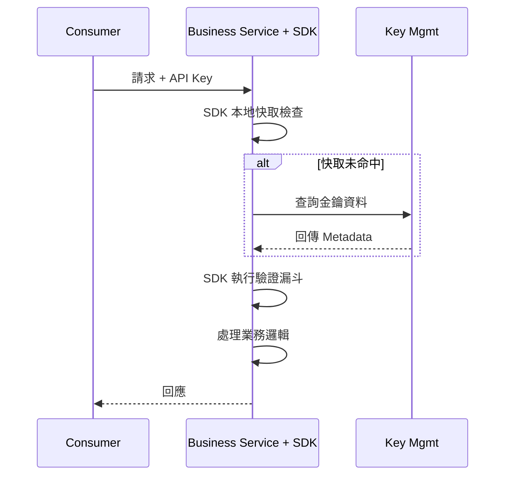
```mermaid
sequenceDiagram
    participant C as Consumer
    participant Biz as Business Service + SDK
    participant KM as Key Mgmt

    C->>Biz: 請求 + API Key
    Biz->>Biz: SDK 本地快取檢查
    alt 快取未命中
        Biz->>KM: 查詢金鑰資料
        KM-->>Biz: 回傳 Metadata
    end
    Biz->>Biz: SDK 執行驗證漏斗
    Biz->>Biz: 處理業務邏輯
    Biz-->>C: 回應
```

**優勢：**

- 最低延遲。驗證在同一過程內執行，無網路跳數。
- 部署簡單。無額外的基礎設施元件。
- 開發者可精細控制驗證流程。

**劣勢：**

- 業務服務有侵入。需要修改程式碼以整合 SDK，且受程式語言限制（需為每種語言提供 SDK）。
- 策略一致性難以保證。不同服務可能使用不同版本的 SDK，行為可能不一致。
- 快取失效受限於 SDK 的實作。需仰賴 SDK 正確處理事件訂閱與快取清除。
- 安全風險。驗證邏輯在業務服務過程內執行，若服務被入侵，驗證可能被繞過。

**適用場景：**對延遲極度敏感的服務、無法部署 Gateway 或 Sidecar 的環境（如 Edge / IoT）、Monolith 架構。

### 7.5 模式比較與選擇指引

| 面向 | Gateway 集中式 | Sidecar | SDK 嵌入式 |
|:---|:---|:---|:---|
| **業務服務侵入性** | 零 | 零 | 有（需改程式碼） |
| **策略一致性** | 最高 | 高 | 低（受 SDK 版本影響） |
| **延遲** | 中（多一跳） | 低 | 最低 |
| **運維複雜度** | 低 | 高 | 低 |
| **快取失效難度** | 低（節點少） | 高（實例多） | 中（依賴 SDK） |
| **East-West 流量** | 弱 | 強 | 強 |
| **安全性** | 高（集中控制） | 高 | 中（可被繞過） |

### 7.6 建議策略：混合模式

實務上，多數組織不會只採用單一模式，而是依流量類型選擇：

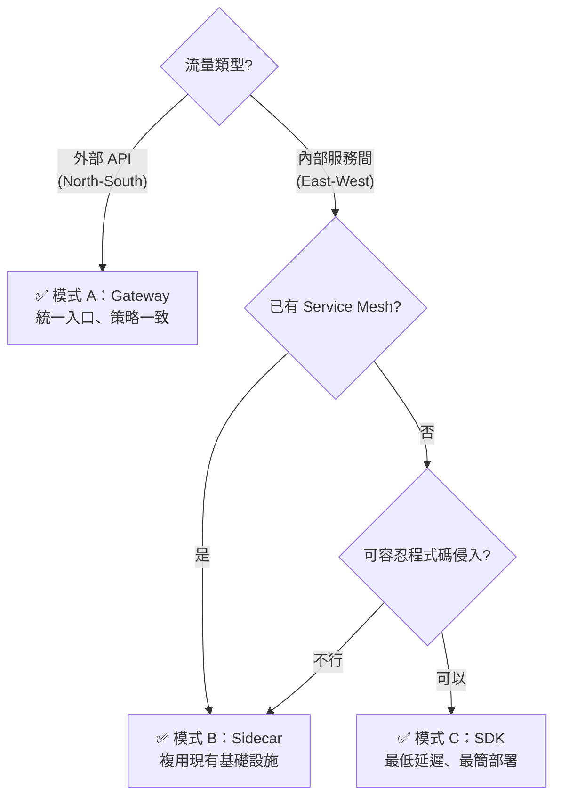
```mermaid
flowchart TD
    Q1{"流量類型?"}
    Q1 -->|"外部 API<br/>(North-South)"| A["✅ 模式 A：Gateway<br/>統一入口、策略一致"]
    Q1 -->|"內部服務間<br/>(East-West)"| Q2{"已有 Service Mesh?"}
    Q2 -->|"是"| B["✅ 模式 B：Sidecar<br/>複用現有基礎設施"]
    Q2 -->|"否"| Q3{"可容忍程式碼侵入?"}
    Q3 -->|"可以"| C["✅ 模式 C：SDK<br/>最低延遲、最簡部署"]
    Q3 -->|"不行"| B
```

典型組合：外部流量走 **Gateway**，內部 M2M 流量走 **Sidecar** 或 **SDK**。金鑰管理系統的設計必須支援多種暴露模式並存，提供統一的查詢介面與事件廣播機制。

## 8. 跨切面關注點

### 8.1 Multi-tenancy（多租戶隔離）

**隔離策略：邏輯隔離（Logical Isolation）**

所有 Bounded Context 共用基礎設施，但透過 TenantId 在資料層強制隔離：

- 所有資料查詢必須攜帶 TenantId 作為過濾條件，禁止無 TenantId 的全局查詢（Security Admin 例外）。
- 所有寫入操作必須驗證操作者屬於目標 Tenant。
- Validation Model 的快取金鑰以 `tenantId:keyHash` 為索引，避免跨租戶撞擊。
- 審計日誌依 TenantId 分區，Tenant 只能查詢自己的記錄。

**跨租戶操作**：僅 Security Admin 擁有跨 Tenant 的查詢權限（用於全局安全審計），且此類操作必須留下審計記錄。

**Noisy Neighbor 防護：**

邏輯隔離無法防止單一租戶透過大量無效請求耗盡共享的驗證層資源。需額外的保護機制：

- **租戶級全局限流**：在 Validation Funnel 的最外層（第 1 層格式檢查之前），依 TenantId 執行總請求速率限制。這是獨立於單一金鑰 RateLimit 的總量控制。
- **無效請求率監控**：當某租戶的請求失敗率異常高時（如持續 401/403 > 80%），自動觸發租戶級降級——暫時縮緊該租戶的全局限流閾值，降低其對共享資源的衝擊。
- **公平排程**：當驗證層接近容量上限時，採用加權公平佇列（Weighted Fair Queuing）確保每個租戶至少獲得其配額以內的處理能力，避免單一租戶佔滿所有處理線程。

### 8.2 審計與合規（Audit & Compliance）

**不可篡改性保證：**

- AuditEntry 採用 Append-only 儲存，禁止 UPDATE 與 DELETE 操作。
- 儲存層必須支援 WORM 語意。
- 日誌應定期匯出至外部 SIEM，確保即使金鑰管理系統本身被入侵，日誌仍可追溯。

**日誌保留策略：**

- 熱資料（近 90 天）：保存在主資料庫，支援快速查詢。
- 冷資料（90 天以上）：歸檔至冷儲存，保留至少 1 年（或依合規要求調整）。

**合規對照：**

| 規範 | 相關要求 | 系統對應 |
|:---|:---|:---|
| PCI-DSS | 金鑰儲存加密、存取控制、審計追蹤 | KeyHash、Scope、AuditEntry |
| GDPR | 資料最小化、可刪除性 | 金鑰僅存雜湊，不存個人資料 |
| SOC 2 | 變更管理、存取控制 | 狀態機、RBAC、Audit |

### 8.3 快取策略

快取是驗證路徑的效能關鍵，但也是安全風險的來源（撤銷延遲）。

**分層快取架構：**

| 層級 | 位置 | 內容 | TTL | 失效機制 |
|:---|:---|:---|:---|:---|
| L1 | Gateway / Sidecar / SDK 本地 | KeyValidationView | 5-15 分鐘 | 事件廣播主動失效 |
| L2 | 共享快取層（如 Redis） | KeyValidationView | 15-30 分鐘 | 事件廣播主動失效 |
| L3 | 金鑰管理系統資料庫 | 完整資料 | - | 單一事實來源 |

**安全事件的快取失效優先級：**

- **Revoked / Locked / Suspended**：必須走主動失效，不得等待 TTL 過期。透過 Pub/Sub 廣播至所有節點。
- **PolicyUpdated**：主動失效，但可容忍短暫延遲（秒級）。
- **lastUsedAt 更新**：非同步、批次寫入。不影響驗證決策，只用於統計與殭屍金鑰偵測。

**快取不可用時的 Fail-safe 機制：**

當 Pub/Sub 通道發生 Network Partition 或共享快取層不可用時，必須有降級策略確保安全性不被犧牲：

- **安全敏感操作強制回源**：當 L1/L2 快取無法確認是否收到最新的失效通知時，對撤銷/鎖定等安全事件相關的驗證請求應強制回源至 L3（金鑰管理系統資料庫）驗證。
- **TTL 自動縮短**：偵測到 Pub/Sub 通道斷裂時，L1 快取的 TTL 應自動縮短至 30 秒以內，加快被動過期速度作為補償。
- **快取版本號校驗**：每次 L2 快取寫入時攜帶版本號，Gateway 讀取時可與金鑰管理系統的當前版本比對，若版本落後則視為快取未命中。
- **Circuit Breaker**：快取層完全不可用時，啟用熔斷機制直接回源至 L3，避免反覆重試快取層增加延遲。

### 8.4 監控與可觀測性（Observability）

**關鍵指標（Metrics）：**

| 指標 | 描述 | 告警條件範例 |
|:---|:---|:---|
| 驗證成功 / 失敗率 | 每個金鑰、每個 Tenant 的成功與失敗比例 | 失敗率 > 20% 持續 5 分鐘 |
| 驗證延遲 | P50 / P95 / P99 | P99 > 100ms |
| 快取命中率 | L1 / L2 快取的命中與未命中比例 | 命中率 < 80% |
| 金鑰狀態分布 | 各狀態的金鑰數量 | Locked 數量突然增加 |
| 即將過期金鑰數 | 30 / 7 / 1 天內將過期的金鑰 | 僅儀表板顯示 |
| 殭屍金鑰數 | 超過 90 天未使用的 Active 金鑰 | 僅儀表板顯示 |

**分散式追蹤（Tracing）：**

驗證請求應攜帶 Trace ID，串聯從 Gateway → Validation Cache → 金鑰管理系統的完整路徑，便於排查延遲問題。

### 8.5 安全性設計

**金鑰明文的生命週期：**

金鑰明文只在以下兩個瞬間存在：
1. 生成時：在金鑰管理系統的記憶體中，計算完雜湊後立即清除。
2. 回傳給 Consumer 時：透過 TLS 加密的回應中。Consumer 收到後即成其責任。

之後的所有流程（儲存、驗證、審計）都只處理雜湊值，絕不觸碰明文。

**恆定時間比較的強制性：**

雜湊驗證必須使用恆定時間比較函式。此需求不僅適用於金鑰管理系統內部，也適用於 SDK。SDK 必須內建恆定時間比較實作，禁止開發者自行實作驗證邏輯。

**傳輸安全：**

- 所有外部通訊強制 TLS。
- 金鑰必須透過 HTTP Header（`Authorization: Bearer <key>`）傳遞，禁止放在 URL 參數（易被 Proxy 日誌記錄）。
- 系統間通訊（金鑰管理系統 ↔ Gateway / Sidecar）使用服務間認證（mTLS 或內部 Token）。

### 8.6 故障模式與降級策略（Failure Modes & Degradation）

#### 金鑰管理系統不可用時的行為

當金鑰管理系統（L3）完全不可用時，Gateway 必須在「服務可用性」與「安全性」之間做出決策：

- **預設策略：Fail-Close**。快取未命中且 L3 不可用時，拒絕請求（回傳 503）。基於設計原則 #1「金鑰即密碼」，安全性優先於可用性。
- **快取命中時允許放行**：若 L1/L2 快取中已有 KeyValidationView 且未過期，仍可放行請求。這是快取存在的核心價值——在主系統短暫不可用時維持驗證能力。
- **可配置降級**：對於可用性要求極高的場景，允許各 Tenant 自行配置 fail-open 策略，但此模式下所有請求必須標記為「降級放行」並寫入審計日誌。

#### 事件發布的可靠性保證

Context 間的 Domain Event 發布必須保證「至少一次」語意，消費者必須確保冪等性：

- **Outbox Pattern**：狀態變更與事件寫入在同一交易中完成（寫入本地 Outbox 表），由獨立的 Relay 程序投遞至訊息佇列。確保事件不會因應用層崩潰而遺失。
- **冪等性設計**：每個 Domain Event 攜帶全局唯一的 `eventId`。消費者（如 Audit、Validation Model）必須以 `eventId` 作為去重依據，容忍重複投遞。
- **事件順序**：同一 Aggregate 的事件必須保證順序（以 Aggregate ID 作為 Partition Key）。跨 Aggregate 的事件不保證順序。

#### 分散式交易策略

本系統中涉及跨 Aggregate 原子性的場景：

- **金鑰建立（CreateKey + CreatePolicy）**：因為 ApiKey 與 AccessPolicy 是 1:1 關係且同時建立，可透過本地交易（同一資料庫）保證原子性。
- **輪替操作（Key A 轉 Rotating + Key B 建立）**：同上，可透過本地交易完成。
- **跨 Context 協調（如 Monitoring 觸發 Lock）**：採用同步呼叫 + 重試。若 Lock 呼叫失敗，Monitoring 必須重試並發送管理員警報（已在 §6.5 定義）。

---

## 9. 架構決策紀錄（ADR 摘要）

以下記錄本設計文件中的關鍵架構決策、備選方案與取捨理由。

### ADR-01：Validation 作為 Read Model 而非獨立 Bounded Context

- **決策**：金鑰驗證定位為 Key Lifecycle + Access Policy 的專用 Read Model。
- **備選**：將 Validation 劃為獨立的 Bounded Context。
- **取捨**：Validation 不擁有自己的業務邏輯，只是組合兩個 Context 的資料做查詢。獨立為 BC 會增加不必要的邊界管理成本。

### ADR-02：Scopes 歸屬於 ApiKey 而非 AccessPolicy

- **決策**：Scopes 放在 ApiKey 實體上。
- **備選**：將 Scopes 放入 AccessPolicy，或建立獨立的 Role/Permission 物件。
- **取捨**：Scopes 描述「金鑰能做什麼」，是金鑰的固有屬性。AccessPolicy 專注於「金鑰怎麼被使用」的操作限制（IP、限流）。分離關注點，避免 AccessPolicy 成為超級物件。

### ADR-03：Locked 過期轉 Revoked（而非 Expired）

- **決策**：Locked 狀態的金鑰過期時轉入 Revoked，其他非終態狀態過期轉入 Expired。
- **備選**：所有過期統一轉 Expired（簡單但丟失安全上下文）；或新增 `is_compromised` 標籤（增加資料模型複雜度）。
- **取捨**：Locked 代表系統偵測到異常，具安全事件意涵。轉為 Revoked 在狀態語意上保留「異常死亡」的上下文，讓安全團隊能透過狀態快速篩選曾涉及安全事件的金鑰，不需額外欄位。

### ADR-04：Locked 與 Suspended 為兩個獨立狀態

- **決策**：區分 Locked（系統自動觸發）與 Suspended（人為手動觸發）。
- **備選**：合併為單一的 INACTIVE 狀態。
- **取捨**：觸發來源不同、業務意圖不同、解除方式不同、審計需求不同。合併會導致系統無法區分「機器判斷」與「人為決策」，影響安全審計的精確度。

### ADR-05：混合服務暴露模式

- **決策**：金鑰管理系統支援 Gateway / Sidecar / SDK 並存，提供統一查詢介面與事件廣播機制。
- **備選**：僅支援單一模式。
- **取捨**：實務上組織內部通常同時存在 North-South 與 East-West 流量，需要不同的暴露模式。統一介面確保不同模式下的驗證行為一致。

### ADR-06：Monitoring → Key Lifecycle 採用同步呼叫

- **決策**：異常偵測觸發的 Lock 命令使用同步呼叫，而非事件驅動。
- **備選**：統一使用事件驅動（與其他 Context 間通訊一致）。
- **取捨**：安全事件不容許最終一致性的延遲。事件驅動可能導致數秒至數十秒的延遲，在此期間被盜用的金鑰仍可通過驗證。同步呼叫確保即時阻斷。

### ADR-07：ApiKey 與 AccessPolicy 採用 1:1 關係

- **決策**：每把金鑰對應一個獨立的 AccessPolicy，不共用。
- **備選**：採用 Many-to-One（多把金鑰共用一個策略範本）。
- **取捨**：1:1 確保修改某把金鑰的策略時不會意外影響其他金鑰（爆炸半徑最小化）。雖然相同配置會重複儲存，但金鑰管理系統的金鑰數量不會大到讓儲存成為瓶頸。
- **未來遷移**：若引入 Policy Template（見 §10.2），可在 AccessPolicy 上新增 `templateId` 欄位，建立時從範本複製初始值，建立後仍然是獨立副本。這確保 1:1 的安全性不變，同時提供範本化的便利性。

---

## 10. 未解問題與未來演進

### 10.1 未解問題（Open Questions）

| # | 問題 | 影響範圍 | 建議決策時機 |
|:---|:---|:---|:---|
| Q1 | 金鑰雜湊演算法的具體選擇（Argon2id vs PBKDF2-SHA256）及其參數調整（記憶體成本、迭代次數） | 儲存層、驗證效能 | 技術選型階段 |
| Q2 | 寬限期的預設長度與最大上限應如何定義？是否依服務敏感等級分級？ | 輪替流程 | 與業務團隊討論 |
| Q3 | 每個 Tenant 的金鑰數量上限及 Active 金鑰數量上限的具體數值 | Tenant 管理 | 與產品團隊討論 |
| Q4 | 審計日誌的具體保留期限應依據哪些合規標準？ | Audit | 與法務 / 合規團隊確認 |
|| Q5 | Impossible Travel 偵測的地理距離與時間門檻應如何設定？ | Monitoring | 與安全團隊討論 |
|| Q6 | 三種外部角色（Consumer / Service Owner / Security Admin）與系統內部實體的對應關係為何？Consumer 是應用程式還是人？權限模型採用 RBAC 還是 Claim-based？ | 全系統 | 架構設計階段 |
|| Q7 | 驗證路徑的目標 QPS 數量級？每個 Tenant 的金鑰數量級？撤銷事件從觸發到全部 Gateway 生效的 SLO？ | 效能、快取、技術選型 | 與產品 / SRE 團隊討論 |
|| Q8 | Consumer 被停權時是否應級聯撤銷其名下所有金鑰？目前狀態機以單一金鑰為粒度，缺少批次操作語意 | 狀態機、流程 | 與業務團隊討論 |
|| Q9 | 輪替期間若 Validation Model 的投影延遲，Key B 已建立但尚未被投影，是否會導致 Key B 驗證失敗？需要定義投影延遲的容忍上限嗎？ | 輪替流程、Validation Model | 架構設計階段 |
||| Q10 | Monitoring 的 Lock 權限是否需要防護機制（如同一金鑰的 Lock 次數上限、或鎖定前確認 baseline 資料的時效性）以避免誤鎖？ | Monitoring | 與安全團隊討論 |
||| Q11 | 金鑰的最大有效期上限應如何定義？是否依環境區分（如 Production 最長 1 年、Sandbox 最長 90 天）？由系統全局設定或由 Tenant 自行配置？ | CreateApiKey Guard、Tenant 管理 | 與產品 / 安全團隊討論 |

### 10.2 未來演進方向

- **請求簽章（Request Signing）**：PRD 中 R-SEC-05 提到支援請求簽章作為高級驗證模式。本版未納入，可作為未來的安全增強。
- **金鑰策略範本（Policy Templates）**：PRD 提到 Service Owner 定義 Plans。未來可支援預定義的策略範本（Bronze / Silver / Gold），簡化金鑰建立流程。
- **自動化輪替（Auto-Rotation）**：當前設計以 Consumer 主動觸發輪替為主。未來可支援系統自動輪替（結合 Webhook 或 Vault 整合）。
- **聯邦式金鑰管理**：若組織擁有多個區域部署，可能需要跨區域的金鑰同步與撤銷廣播機制。
