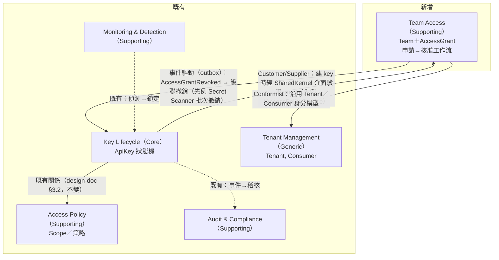

# Context Map — role-management discovery（Phase D）

> Phase C 模型經使用者裁決接受（2026-07-11）。既有 BC 的邊界與分類以 design-doc §3.1 為權威，本檔只新增 Team Access 與受影響的關係線。

## Context Map（mermaid）

## BC 清單與分類

| Bounded Context | 分類 | 狀態 | 本探索的變化 |
|---|---|---|---|
| **Team Access**（★新） | 🟢 Supporting | 使用者裁決接受（2026-07-11） | 新 BC：`Team`（團隊識別＋管理者名單）＋`AccessGrant`（申請→核准→修改→收回）；分類理由：金鑰發放的賦能前置，非產品差異化核心 |
| Key Lifecycle | 🔵 Core | 不變 | 微擴：`ApiKey` 建立時引用 grantId＋快照 scope；訂閱 `AccessGrantRevoked` 級聯撤銷 |
| Access Policy | 🟢 Supporting | 不變 | Scope Registry 的**歸屬單位**由全局 Service Owner 變為各團隊（資料歸屬調整，邊界不動） |
| Tenant Management | ⚪ Generic | 不變 | 無（單租戶裁決下不受影響）；`Consumer` 保留為 Team 的使用方投影（1:1） |
| Audit & Compliance | 🟢 Supporting | 不變 | 無（授權事件天然進稽核流） |
| Monitoring & Detection | 🟢 Supporting | 不變 | 無 |

## 關係摘要

1. **KeyLifecycle → Team Access（Customer/Supplier）**：金鑰建立 guard 需查詢「grant 是否 Active、申請的 scope 是否 ⊆ grant scope」；走 SharedKernel 介面，不直接引用 BC。
2. **Team Access → KeyLifecycle（事件驅動）**：`AccessGrantRevoked` 經 outbox 觸發級聯撤銷（H3 裁決），復用批次撤銷組合模式。
3. **Team Access → Tenant Management（Conformist）**：沿用 TenantId／ConsumerId 身分模型，不做轉換。
